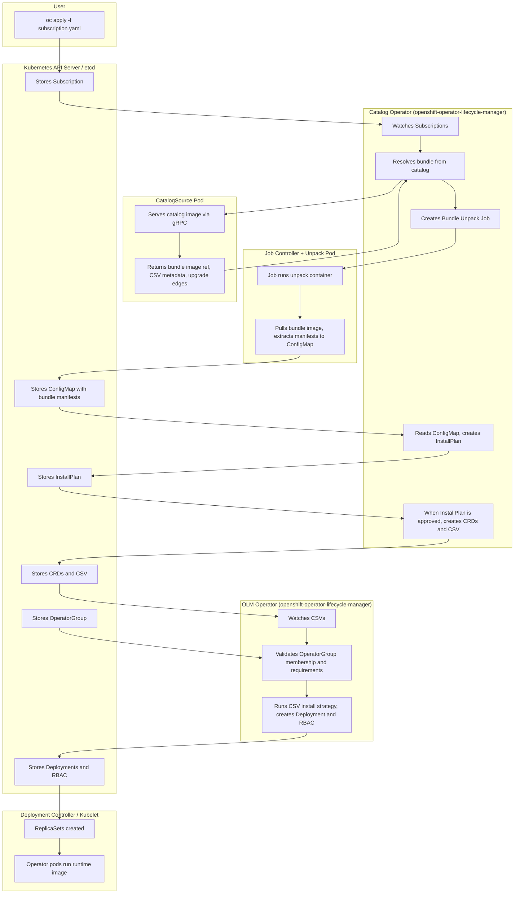

# OpenShift OLM Field Guide for Disconnected Environments

This guide is for Red Hat consultants and customer platform teams who need to mirror and upgrade OLM-based operators in disconnected or air-gapped OpenShift environments. It focuses on the part that usually causes real project delays: decision quality. In air-gap programs, every mirror run has cost (time, bandwidth, media handling, security review, and change windows), so the goal is not to mirror everything. The goal is to mirror exactly what your cluster needs, on a supported path, with predictable operational outcomes.

The official OpenShift and `oc-mirror` documentation already defines supported commands, schemas, and workflows. This guide is a companion to those references and focuses on practical execution choices:

- choosing the exact supported target version from the support matrix
- selecting the right channel for that target and OCP version
- minimizing mirrored content by following real upgrade edges (`replaces` and `skipRange`)
- applying generated resources in the right order so the disconnected cluster behaves as expected

**What this guide is not:**

- not a replacement for official product documentation, support policy, or release notes
- not a generic Kubernetes operator tutorial
- not a promise that one workflow fits every security boundary or customer process

**How to use this guide:**

- read **Section 1** once to lock the mental model (`CatalogSource`, `Subscription`, `InstallPlan`, `OperatorGroup`, `CSV`, bundle)
- use **Section 2** as the execution playbook for `oc-mirror` v2 and disconnected operations
- treat examples as templates and always validate channel/version decisions against your product support matrix

---

## 1. Foundations

The terminology, installation flow, and mental model below are the core concepts you need before working with catalogs or disconnected mirroring.

### 1.1 Terminology (in dependency order)

Terms are defined so that each concept is introduced before it is used. Read the sections in order.

#### 1.1.1 Operator

An **operator** is application-specific automation for Kubernetes (and OpenShift). In practice it is one or more controllers plus API extensions that provide additional functionality to the cluster.

- **Cluster Operators** — Managed by the **Cluster Version Operator (CVO)**. They are installed by default and perform core cluster functions (networking, ingress, monitoring, etc.). You do not install them via OLM.
- **Optional add-on Operators** — Managed by the **Operator Lifecycle Manager (OLM)**. They are made available through catalogs and can be installed by users or administrators to run applications on the cluster. These are also called **OLM-based operators**.

This guide is about OLM-based operators: how they are packaged, how they appear in catalogs, and how OLM installs them when you subscribe.

#### 1.1.2 Operator Lifecycle Manager (OLM)

The **Operator Lifecycle Manager (OLM)** is the component in OpenShift that installs, upgrades, and manages the lifecycle of OLM-based operators. It does not manage Cluster Operators (those are managed by the CVO).

OLM has two main controllers that work together:

- **Catalog Operator** — Resolves *which* operator version to install by querying catalog metadata; manages `CatalogSource`, `Subscription`, and `InstallPlan`; and creates required resources from approved `InstallPlan`s (notably `CRD`s and `CSV`s).
- **OLM Operator** — Watches `CSV`s and runs the install strategy after prerequisites are met, creating runtime resources such as `Deployment`s and RBAC and monitoring operator health.

You will see these as two pods in OpenShift: `catalog-operator` and `olm-operator` in the `openshift-operator-lifecycle-manager` namespace.

#### 1.1.3 Bundle

A **bundle** is one installable version of an operator. That version is shipped as a **bundle image**: a non-runnable OCI image that holds the operator's manifests and metadata. One bundle = one operator version = one bundle image. OLM pulls the image and reads its contents to install the operator; it does not run the image as a workload.

**Layout.** A bundle image has two main parts:

- **`manifests/`** — YAML that OLM uses to install this version. It contains:
  - **One ClusterServiceVersion (`CSV`)** — A single YAML file that identifies this operator version (name, version, description, etc.) and defines how to install it. The install definition lives inside the `CSV`: the `Deployment` spec and RBAC (`ServiceAccount`, `Role`, `RoleBinding`) are embedded in the `CSV` under `spec.install` (e.g. `strategy.deployments`, `permissions`, `clusterPermissions`). The `CSV` also declares which `CRD`s this operator owns or requires.
  - **One or more `CRD` manifests** — Separate YAML files for the custom resource definitions. OLM installs these `CRD`s first, then creates the resources specified in the `CSV` (RBAC and `Deployment`).
- **`metadata/`** — Annotations used when this bundle is published or served elsewhere. For installation, OLM only needs `manifests/`.

So: the **bundle image** is the artifact in the registry; the **`CSV`** is the main install manifest inside it. Once OLM has unpacked the bundle and applied the `CSV`, it uses the `CSV`'s embedded `Deployment` and RBAC to create the operator's workload on the cluster.

#### 1.1.4 Catalog

A **catalog** is the metadata that tells OLM which operator packages exist, which versions (bundles) are available, and how upgrades connect (channels, replace edges, skip ranges). It does *not* contain the operator container images themselves; it points to bundle images.

**Catalog image (index image).** In OpenShift this metadata is stored as a file-based catalog inside an OCI container image. That image is the **catalog image** (also called **index image**). Documentation that refers to "the catalog," "catalog image," or "index image" usually means the same thing: an image whose contents are catalog metadata (package definitions, channels, bundle references, upgrade edges).

**Catalog families.** In current OCP releases, Red Hat provides three default catalog sources:

- **Red Hat Operators** — Red Hat–published content.
- **Certified Operators** — Partner content certified by Red Hat.
- **Community Operators** — Community-maintained content (different support model).

In some older OCP releases and environments, you may also see **Red Hat Marketplace** (`redhat-marketplace`) as an additional catalog source.

**Version per OCP version.** Each catalog image is tagged by OpenShift Container Platform (OCP) minor version. For example, `redhat-operator-index:v4.16`, `redhat-operator-index:v4.18`, and `certified-operator-index:v4.18` are distinct images. The package set, default channels, and supported upgrade paths can differ between OCP versions, so you must use the catalog image that matches the OCP minor you are targeting (e.g. `v4.18` for an OCP 4.18 cluster). They are not interchangeable across versions.

**`CatalogSource`.** The cluster needs a Kubernetes resource that tells OLM *where* to find a catalog. A **`CatalogSource`** (in OpenShift, typically in `openshift-marketplace`) points at a catalog image. OLM uses it to discover packages, channels, and bundles and to resolve `Subscription`s to a concrete bundle/`CSV`. The cluster runs a pod that serves the catalog (e.g. using `opm` or the registry server) and exposes a gRPC API; the Catalog Operator queries this API. Without a `CatalogSource` pointing at your catalog image, OLM cannot see your operators. In disconnected environments, the catalog image is usually hosted in your internal registry and the `CatalogSource` points to that image.

#### 1.1.5 Package

A **package** is one operator product inside a catalog. It has a name (e.g. `advanced-cluster-management`, `openshift-pipelines-operator-rh`) and contains one or more channels and many bundles (one per version).

#### 1.1.6 Channel

A **channel** is an upgrade track within a package. It is a named sequence of bundle versions and upgrade edges (e.g. "from 2.13.4 you can upgrade to 2.13.5"). Channel names are chosen by the publisher (e.g. `stable`, `release-2.13`, `latest`). A package can have multiple channels, and the same bundle version can appear in more than one channel.

#### 1.1.7 Subscription

A **`Subscription`** is a Kubernetes resource that expresses: “I want this operator package, from this catalog, on this channel, and here is how I want updates approved.”

It specifies:

- **Package name** — e.g. `advanced-cluster-management`.
- **`CatalogSource`** (and namespace) — Which catalog to use (e.g. `redhat-operators`, `sourceNamespace: openshift-marketplace`).
- **Channel** — e.g. `release-2.13` or `stable`.
- **Approval** — `Automatic` or `Manual` for installing/upgrading (controls whether `InstallPlan`s are auto-approved).
- **Optional `startingCSV`** — Initial CSV to start from when creating a new subscription path.

The **Catalog Operator** watches `Subscription`s. When it sees a `Subscription`, it consults the catalog (via the `CatalogSource`'s gRPC API), resolves the appropriate bundle(s) for the requested channel, and creates an `InstallPlan`.

#### 1.1.8 InstallPlan

An **`InstallPlan`** is a Kubernetes resource generated by the **Catalog Operator**. It is the *plan* for what to install: a list of resources (`CRD`s, `CSV`, etc.) that correspond to the resolved bundle(s).

- **Approval** — If the `Subscription` has `installPlanApproval: Manual`, the `InstallPlan` must be approved (e.g. `spec.approved: true`) before the **Catalog Operator** executes it. If approval is `Automatic`, the Catalog Operator approves it and installation proceeds.
- **Execution** — The **Catalog Operator** creates the resources listed in the approved `InstallPlan` (for example `CRD`s and `CSV`s). The **OLM Operator** then reconciles the resulting `CSV` and runs its install strategy to create runtime resources.
- **History** — `InstallPlan`s are kept as a record of what was installed; they are not deleted when upgrades occur.

#### 1.1.9 OperatorGroup

An **`OperatorGroup`** defines the target namespaces for operators installed in a namespace and is a required part of OLM tenancy/scoping.

- **Membership gate** — A `CSV` must be an active member of an `OperatorGroup` before OLM runs its install strategy.
- **Target namespace scope** — The `OperatorGroup` determines where RBAC is projected and which namespaces the operator is configured to watch.
- **Practical rule** — In customer environments, keep one clearly-owned `OperatorGroup` in each namespace where you install operators, and avoid overlapping/conflicting groups.

---

### 1.2 OLM installation flow (Subscription to running operator)

The following flow describes what happens when you create a `Subscription` and OLM installs an operator. Component names (Catalog Operator vs OLM Operator) match OpenShift's actual controllers.



**Notes:**

- The **Catalog Operator** is responsible for `Subscription` resolution, catalog queries, bundle unpack Job, `InstallPlan` creation, and execution of approved `InstallPlan`s (resource creation such as `CRD`s and `CSV`s).
- The **OLM Operator** reconciles `CSV`s and runs the `CSV` install strategy (creating runtime resources like `Deployment`s and RBAC) after requirements are met.
- A `CSV` must be an active member of an `OperatorGroup` before the OLM Operator runs install strategy.
- The bundle image is used only for *unpacking* (manifests to `ConfigMap`). The **operator's runtime container image** (referenced in the `CSV`'s `Deployment` spec) is what actually runs in the operator pods.


---

### 1.3 Mental model

| Concept | One-line mental model |
|--------|------------------------|
| **Operator** | Application automation (controllers + APIs). OLM-based = optional add-on managed by OLM. |
| **OLM** | Installs and manages OLM-based operators. Catalog Operator = resolve + execute approved `InstallPlan`. OLM Operator = reconcile `CSV` and run install strategy. |
| **Bundle / bundle image** | One operator version = one non-runnable image with manifests/ (`CSV` + `CRD`s) and metadata/. |
| **`CSV`** | Single installable-version manifest inside the bundle: identity, install strategy (`Deployment` + RBAC embedded), and `CRD` references. |
| **Catalog / catalog image / `CatalogSource`** | Catalog = metadata (packages, channels, bundles). Catalog image = OCI image holding that metadata; one per OCP minor. `CatalogSource` = cluster resource pointing at a catalog image. |
| **Package** | One operator product in a catalog (e.g. advanced-cluster-management). |
| **Channel** | Upgrade track inside a package (e.g. stable, release-2.13). |
| **`Subscription`** | "I want this package from this catalog and channel." Drives resolution and `InstallPlan`. |
| **`OperatorGroup`** | Defines tenancy/scope for operators in a namespace; `CSV` must be an active member before install strategy runs. |
| **`InstallPlan`** | Catalog Operator's plan (list of resources to install). Catalog Operator executes it when approved. |

---

## 2. oc-mirror

oc-mirror is the supported Red Hat tool for copying OpenShift and operator content from external registries (such as `registry.redhat.io`) into your own registry or onto disk. In disconnected or air-gapped environments, clusters cannot pull images from the internet; oc-mirror runs on a connected host (or bastion) to mirror the content you need, so you can then move it across the boundary and serve it from an internal registry.

### 2.1 What oc-mirror does

oc-mirror uses a single declarative **ImageSetConfiguration** file to decide what to copy. It can mirror:

- **Platform (OCP) release images and update graph** — For installing or upgrading the cluster itself in a disconnected way.
- **Operator catalogs** — Catalog images (index images) and the bundle images they reference, so OLM on the disconnected cluster can install and upgrade operators.
- **Additional images** — Arbitrary OCI images that your workloads need and that are not part of OLM.

The tool does not install or configure the cluster; it only copies images and generates manifests (e.g. `ImageDigestMirrorSet`, `ImageTagMirrorSet`, `CatalogSource` or `ClusterCatalog`) that you apply on the cluster so it uses your internal registry.

### 2.2 Workflows: m2d, d2m, m2m

Three workflows cover different connectivity patterns:

| Workflow | When to use | What happens |
|----------|-------------|--------------|
| **m2d (mirror-to-disk)** | You have a connected host. | oc-mirror pulls images from the source (e.g. `registry.redhat.io`) and writes them as tarballs to a local directory. You then move that directory (e.g. via removable media) across the air-gap. |
| **d2m (disk-to-mirror)** | You are on the air-gapped side with the tarballs. | oc-mirror reads the tarballs and pushes the images to your internal registry. No internet access required. |
| **m2m (mirror-to-mirror)** | A host can reach both the internet and your internal registry. | oc-mirror copies directly from the source registry to your registry. No tarballs or physical transfer. |

For a full air-gap, you typically run **m2d** on a connected machine, transfer the tarballs, then run **d2m** on a host inside the secure network. If you have a bastion that can see both sides, **m2m** avoids the intermediate disk step.

### 2.3 Set up oc-mirror

#### 2.3.1 Obtain the binary

Download oc-mirror from the [Red Hat Hybrid Cloud Console](https://console.redhat.com/openshift/downloads): **OpenShift disconnected installation tools** → **OpenShift Client (oc) mirror plugin** → choose your OS and architecture → Download.

The binary is not tied to a single OCP minor version. The coupling to a specific release is in your **ImageSetConfiguration** (e.g. which catalog image tag you use, such as `redhat-operator-index:v4.18`). Use the build that your OpenShift toolchain policy expects and confirm behavior with:

```bash
oc-mirror --v2 --help
```

#### 2.3.2 Standalone vs plugin

You will see both **`oc-mirror`** and **`oc mirror`** in documentation. They use the **same binary**:

- **Standalone** — The executable is named `oc-mirror`. Run it by path (e.g. `./oc-mirror`). No `oc` CLI is required. Useful on a jump host used only for mirroring.
- **Plugin** — If `oc-mirror` is on your `PATH`, the OpenShift CLI (`oc`) invokes it when you run `oc mirror`. One command for both cluster operations and mirroring.

#### 2.3.3 Use v2

oc-mirror v1 is deprecated as of OCP 4.18 and will be removed in a future release. For all mirroring (m2d, d2m, m2m), use **v2**:

- Pass **`--v2`** on the command line.
- Use **`apiVersion: mirror.openshift.io/v2alpha1`** in your ImageSetConfiguration.

The only v1-only feature still useful for exploration is `oc mirror list operators` (catalogs, packages, channels); it was not ported to v2. Prefer v2 for any real mirror run.

#### 2.3.4 Authentication

oc-mirror must authenticate to `registry.redhat.io` (and optionally other registries). It does **not** require Podman or Docker at runtime; it is a self-contained binary that uses the `containers/image` library. It does require a valid **auth file** in a format that library understands.

**Default auth file locations** (see upstream v2 README; your binary may differ, confirm with `--help`):

- `$XDG_RUNTIME_DIR/containers/auth.json`
- `~/.docker/config.json`

If your system uses another path (e.g. `~/.config/containers/auth.json` on some Podman setups), pass **`--authfile`** explicitly so oc-mirror finds the file.

**How to populate the auth file:**

1. **If Podman is available:** Run `podman login registry.redhat.io`. This writes credentials to a path oc-mirror can use (or that you can point to with `--authfile`).
2. **If not:** Download your [pull secret](https://console.redhat.com/openshift/install/pull-secret) from the Red Hat Hybrid Cloud Console. The file is valid JSON with an `auths` key; save it as `auth.json` (or another path and pass `--authfile`).

Example with an explicit auth file:

```bash
oc-mirror --authfile /etc/mirror/pull-secret -c config.yaml file:///mirror-dir --v2
```

### 2.4 What you need before mirroring

Before you run oc-mirror you need:

1. **ImageSetConfiguration** — A YAML file (e.g. `config.yaml`) that specifies what to mirror: platform channels, operator catalogs and packages/channels/versions, and any additional images. See section 2.7 for how to define it.
2. **Destination** — For **m2d**: a local directory path (e.g. `file:///mnt/usb/mirror-dir`). For **d2m** or **m2m**: a registry URL (e.g. `docker://registry.example.com:5000`).
3. **Credentials** — Auth file for the source registry (and for d2m/m2m, access to the destination registry as needed).

After a successful run, oc-mirror writes tarballs (m2d) and/or pushes images (d2m, m2m) and generates cluster resources (mirror sets, `CatalogSource` or `ClusterCatalog`, etc.) that you apply on the cluster so it uses the mirrored content.

### 2.5 Resilient run flags

Long mirror runs can fail on slow or flaky links. Two flags improve reliability:

- **`--retry-times N`** — How many times to retry a failed image pull before giving up. The v2 README default is `2`; for production or unreliable networks, use at least `5`. The only cost is extra wait time on repeated failures.
- **`--image-timeout D`** — Per-image timeout as a Go duration (`10m`, `30m`, `1h`). Default is `10m0s`, which can be too short for large operator bundles on a slow link. Use `1h` when pulling through a throttled or unstable connection.

Example production-style m2d command:

```bash
oc-mirror \
  -c imagesetconfig.yaml \
  file:///mnt/usb/mirror-dir \
  --v2 \
  --retry-times 5 \
  --image-timeout 1h \
  --authfile /etc/mirror/auth.json
```

### 2.6 Workspace vs cache

Do not confuse these two directories:

- **Workspace** — The `file://` path you pass on the command line. For **m2d** it holds tarballs and `working-dir/`. For **m2m** it holds only metadata (no tarballs). Only the tarballs cross the air-gap; `working-dir/` is recreated from the tarballs when you run d2m on the other side.
- **Cache** — An internal directory (default under `$HOME`; override with `--cache-dir`; confirm with `oc-mirror --v2 --help`) where oc-mirror stores blobs and metadata for performance. It is separate from the workspace. Do not transfer the cache across the air-gap. Deleting it does not delete your tarballs; the next run will re-download more. Delete the cache only if it is corrupted.

### 2.7 ImageSetConfiguration

The ImageSetConfiguration is the single YAML file that tells oc-mirror what to mirror. Correct configuration keeps runs small and predictable.

**Minimal structure:**

```yaml
kind: ImageSetConfiguration
apiVersion: mirror.openshift.io/v2alpha1
mirror:
  platform:
    channels:
      - name: stable-4.18
        minVersion: 4.18.1
        maxVersion: 4.18.1
    graph: true
  operators:
    - catalog: registry.redhat.io/redhat/redhat-operator-index:v4.18
      packages:
        - name: compliance-operator
          channels:
            - name: stable
              minVersion: 1.7.0
  additionalImages:
    - name: quay.io/example/my-app:latest
```

**Operators stanza (read left to right):** `catalog` → which index; `packages[].name` → which operator; `channels[].name` → which channel; `minVersion` / `maxVersion` → which versions. If you omit a level, oc-mirror chooses for you, which often leads to oversized mirrors.

**Channel names** are publisher-defined labels (e.g. `release-2.13`, `stable`, `latest`). There is no global convention. Prefer the channel that matches your OCP support matrix; avoid relying on `latest` unless the vendor documents it for your version.

**minVersion / maxVersion:** Omit `maxVersion` to allow future z-streams on the next run (floating head). Omit both to mirror only the channel head. If you set version bounds but do not name a channel, oc-mirror uses the package **default channel**, which is often not the one supported for your OCP version — always name the channel explicitly.

**additionalImages** — For non-operator OCI images (e.g. app base images) that must be available in the disconnected environment. Plain image copies; no OLM semantics.

### 2.8 skipRange and minimal mirror set

Mirroring every bundle between the installed version and the target wastes space and time. **skipRange** is catalog metadata that lets a bundle declare a semver range from which it can be installed in one OLM hop (e.g. `>=2.11.0 <2.13.5`). So you may only need to mirror the target bundle, not every intermediate version.

**Find skipRange:** Catalogs are file-based (FBC). Render to JSON with `opm render <catalog-image> > catalog.json`. The output is a JSON stream (one object per line). Use `jq` on objects with `"schema": "olm.channel"`; their `entries[]` contain `name`, `replaces`, and `skipRange`.

**Path solver script:** If you have `resolve-operator-path.sh`, run it with the package name, current version, target version, and the `opm render` output. It prints the shortest valid hop path and an ImageSetConfiguration snippet. It requires Bash 4+ and `jq`. Use the snippet as a starting point; add `maxVersion` if you want an exact pin.

**Exploration shortcut (v1, deprecated):** `oc mirror list operators --catalog=... --package=... --v1` and `--channel` list channels and versions without rendering the full catalog. Prefer `opm render` and the path solver for building the real config.

**OCP Operator Upgrade Information (OUIC):** [access.redhat.com/labs/ocpouic/](https://access.redhat.com/labs/ocpouic/) helps visualize upgrade paths. Do not trust its default channel — check the product support matrix for your OCP version.

### 2.9 Running m2d, d2m, and m2m

**m2d (connected):** Destination is `file:///path/to/mirror-dir`. Output: `mirror_seq1_000000.tar` (and more for large runs) plus `working-dir/` (metadata, sequence state, cluster-resources). Transfer **only the tarballs**; leave `working-dir/` behind. It is regenerated when you run d2m.

| What | Transfer? |
|------|-----------|
| `mirror_seq*.tar` | **Yes** |
| `working-dir/` | **No** |

**d2m (air-gapped):** Copy tarballs to the host, then:

```bash
oc-mirror -c imagesetconfig.yaml \
  --from file:///path/to/mirror-dir \
  docker://airgapped-registry:5000 \
  --v2 --retry-times 3
```

oc-mirror reads the tarballs, recreates `working-dir/`, and pushes to the registry.

**m2m (bastion):** Use `--workspace file:///path/to/workspace` and a `docker://` destination. No tarballs; content goes straight to the registry. The workspace holds only metadata.

**Incremental runs:** oc-mirror tracks state. Running m2d again with the same workspace mirrors only what changed. Use `--since 2025-06-01` to restrict to content newer than a date. Delete the workspace only when you need a full reseed.

### 2.10 Applying generated resources

After d2m or m2m, apply the manifests under `working-dir/cluster-resources/` in the correct order.

**What is generated:** `idms.yaml` (`ImageDigestMirrorSet`), `itms.yaml` (`ImageTagMirrorSet`), and either `catalogsource.yaml` or `clusterCatalog.yaml` (or both, depending on build). If you mirrored the platform update graph, `updateservice.yaml` may also be present. `ImageDigestMirrorSet`/`ImageTagMirrorSet` tell the cluster to redirect pulls to your registry; the catalog manifest points OLM at your mirrored index.

**Apply order (critical):** Apply `ImageDigestMirrorSet` and `ImageTagMirrorSet` first (via the generated YAML files), then wait for the MachineConfigPool rollout to complete. Only then apply the catalog manifest. If you apply the catalog first, the catalog pod may try to pull from `registry.redhat.io` and fail in an air-gap.

```bash
oc apply -f working-dir/cluster-resources/idms.yaml
oc apply -f working-dir/cluster-resources/itms.yaml
oc wait mcp/worker --for condition=Updated --timeout=30m
oc wait mcp/master --for condition=Updated --timeout=30m
# Then apply the generated catalogsource.yaml or clusterCatalog.yaml
oc get catalogsource -n openshift-marketplace
oc get pods -n openshift-marketplace
```

**Filtered vs full index:** If the catalog image is **filtered**, OperatorHub shows only what you mirrored; use the generated `CatalogSource`/`ClusterCatalog` as-is. If it is **full** (OperatorHub shows all Red Hat operators), do not replace the default `redhat-operators` `CatalogSource`. Retag the mirrored index and create a **new** `CatalogSource` (e.g. `redhat-operators-mirrored`) pointing at the retagged image so only your mirrored content is used.

### 2.11 End-to-end operator upgrade (summary)

1. Determine the minimal mirror set (e.g. `opm render` + path solver or skipRange inspection).
2. Write the ImageSetConfiguration (catalog image for your OCP minor, package, channel from support matrix, minVersion/maxVersion as needed).
3. Run m2d with `--v2 --retry-times 5 --image-timeout 1h` (and `--authfile` if needed).
4. Transfer only `mirror_seq*.tar` to the air-gapped side.
5. Run d2m with `--from file:///path/to/tarballs` and `docker://your-registry`.
6. Apply IDMS and ITMS, wait for MCP rollout, then apply the generated catalog manifest (or create a new `CatalogSource` for a full index).
7. Update the `Subscription` (channel, source, `installPlanApproval`, `startingCSV` if desired) and approve the `InstallPlan`.

### 2.12 Troubleshooting

| Symptom | Likely cause | Fix |
|--------|--------------|-----|
| oc-mirror fails mid-run on a slow link | Retry/timeout too low | Increase `--retry-times` and `--image-timeout` (e.g. `1h`) |
| d2m cannot find content | Wrong `--from` or tarballs missing/corrupt | Ensure directory has `mirror_seq*.tar` and matches `--from` |
| OperatorHub empty after push | Catalog manifest not applied or catalog pod failing | Apply generated `catalogsource.yaml`/`clusterCatalog.yaml`; check catalog pod logs |
| Catalog pod ImagePullBackOff (disconnected) | Mirror redirects not applied first or MCP not updated | Apply idms/itms YAMLs, wait for MCP rollout, then re-apply catalog |
| Operator tile present but install fails on image pull | Full index but not all packages mirrored | Use a separate `CatalogSource` for the mirrored subset (retag and new `CatalogSource`) |
| OLM does not offer expected upgrade | Wrong channel, unsupported channel, or target not mirrored | Align `Subscription` channel with support matrix; confirm target bundle is in mirrored catalog |

### 2.13 Quick reference (flags)

| Flag | Purpose | When to use |
|------|----------|-------------|
| `--v2` | Use v2 behavior | Always |
| `--retry-times N` | Retry failed pulls N times | Production; set at least 3–5 |
| `--image-timeout D` | Per-image timeout (`10m`, `1h`) | Slow links or large images |
| `--authfile` | Auth file path | Non-default credential location |
| `--from` | Source directory for d2m | Air-gap: directory containing tarballs |
| `--workspace` | Metadata workspace for m2m | Bastion m2m runs |
| `--since` | Only content newer than date | Incremental runs |
| `--cache-dir` | Override cache location | Custom layout or shared systems |

### 2.14 Caveats

- **skipDependencies** in ImageSetConfiguration is not a safe substitute for testing; validate in pre-production if you rely on dependency trimming.
- **Catalog default channel** often targets a newer OCP than yours. Always set the `Subscription` channel from the product support matrix.
- **Mirror redirect (IDMS/ITMS) rollout** triggers a MachineConfig change and rolling node restart (30+ minutes on large clusters). Apply catalog only after rollout completes.
- **v1 is deprecated.** Use `opm render` (and path solver) for real workflows; reserve `oc mirror list operators --v1` for quick exploration only.

### 2.15 References

- [oc-mirror README (v2)](https://github.com/openshift/oc-mirror/blob/main/README.md)
- [oc-mirror on GitHub](https://github.com/openshift/oc-mirror)
- [OCP Disconnected installation mirroring](https://docs.openshift.com/container-platform/latest/installing/disconnected_install/installing-mirroring-disconnected.html)
- [OCP Operator Upgrade Information (OUIC)](https://access.redhat.com/labs/ocpouic/)
- [Red Hat solution 7061405 — EUS shortest path and oc-mirror](https://access.redhat.com/solutions/7061405)
- [File-based catalogs (OLM)](https://olm.operatorframework.io/docs/reference/file-based-catalogs/)
