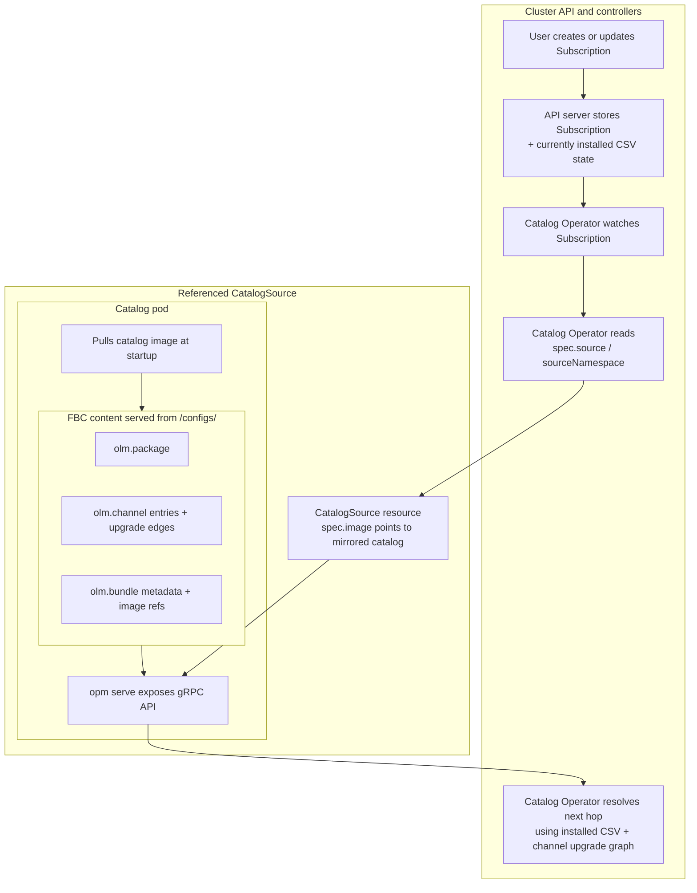
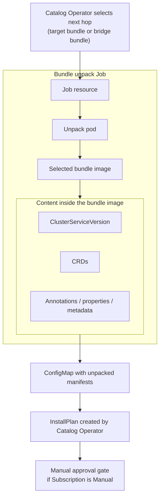
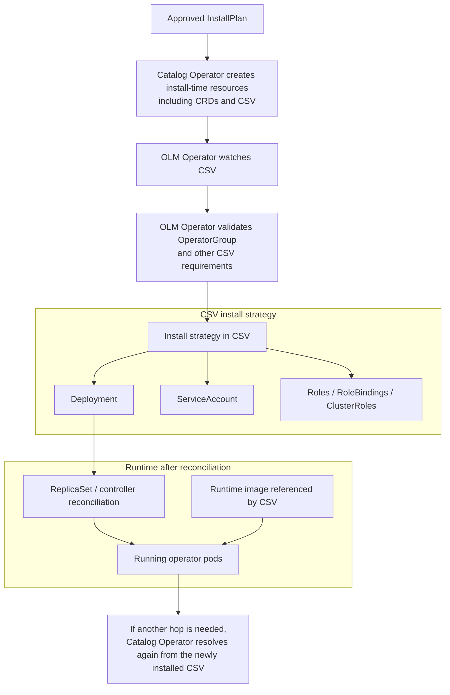

[< Back to main guide](../README.md) | [Next: oc-mirror >](../02-oc-mirror/README.md)

# Foundations

The terminology, installation flow, and mental model below are the core concepts you need before working with catalogs or disconnected mirroring.

## Terminology

Terms are ordered to make the flow easier to follow: each concept is introduced before it is used heavily in later sections.

### Operator

An **operator** is application-specific automation for Kubernetes (and OpenShift). In practice it is one or more controllers plus API extensions that provide additional functionality to the cluster.

- **Cluster Operators** - Shipped as part of the OpenShift release payload and managed by the **Cluster Version Operator (CVO)**. During cluster installation and cluster upgrades, CVO deploys them as part of the platform lifecycle. You do not install these through OLM.
- **Optional add-on Operators** - Managed by **Operator Lifecycle Manager (OLM)** (detailed in the OLM section below). Unlike Cluster Operators, these are selected per environment and installed from catalogs based on your package/channel/subscription choices. This guide primarily targets these OLM-based operators.

### Package

A **package** is the top-level product name used to identify an operator offering (for example `advanced-cluster-management`). The next terms explain how that package is represented and delivered.

### Bundle (bundle image)

> [!NOTE]
> In this guide, **bundle** means **bundle image** unless explicitly stated otherwise.

A bundle image is one installable operator version, shipped as a non-runnable OCI image. Think of it as a container image used purely as a **delivery envelope for YAML files** - it contains no binaries, no entrypoint, and no running process. During installation, OLM creates an unpack Job that **pulls the bundle image from the container registry**, extracts the YAML manifests from it, and writes them into a `ConfigMap`. OLM does not run the bundle image as a workload.

**Directory layout.** A bundle image has two directories that OLM uses:

- **`manifests/`** - YAML manifests for installation: one ClusterServiceVersion (`CSV`) describing the operator version and install strategy, and one or more `CRD` manifests required by that version.
- **`metadata/`** - Catalog annotations used by tooling, primarily `annotations.yaml` which tells `opm` how to index the bundle into a catalog.

Some bundles include additional directories (e.g. `tests/` for operator scorecard tests), but OLM only reads `manifests/` and `metadata/`.

### Channel

A **channel** is an upgrade lane within a package. It is a named sequence of bundle entries and upgrade edges (for example `stable`, `release-2.13`, `latest`). Bundles within a channel are typically versioned as `x.y.z` (major.minor.patch / z-stream).

Publishers use channels to organize upgrade graphs and support streams. A package can expose multiple channels, and a bundle version can appear in more than one channel. In disconnected environments, channels usually matter less as release-cadence labels and more as metadata you must inspect carefully, because they complicate the decision of which bundles you actually need to mirror.

### Catalog

A **catalog** is metadata that tells OLM what packages/channels/bundles exist and how upgrades connect (`replaces`, `skipRange`). It contains upgrade-graph metadata and base64-encoded copies of bundle manifests (CSV, CRDs), but it does **not** contain the operator's runtime container images or the bundle images themselves - those are separate OCI images pulled from the registry at install time.

In a **file-based catalog (FBC)**, which is the current JSON/YAML-based catalog format that replaced the older SQLite-backed index format, channel entries reference bundle names and bundle objects include the backing bundle image reference (typically digest-resolved at mirror/install time). That is the "pointer" from package/channel metadata to actual installable content.

In OpenShift, this metadata is stored in an OCI **catalog image** (also called **index image**), commonly from families such as:

- **Red Hat Operators** - `registry.redhat.io/redhat/redhat-operator-index:v4.<minor>`
- **Certified Operators** - `registry.redhat.io/redhat/certified-operator-index:v4.<minor>`
- **Community Operators** - `registry.redhat.io/redhat/community-operator-index:v4.<minor>`

Some older releases and environments may also include **Red Hat Marketplace** (`redhat-marketplace`).

Catalog images are versioned by OCP minor (for example `redhat-operator-index:v4.18`) and are not interchangeable across OCP minors. Modern index images carry **file-based catalog (FBC)** content. The FBC tooling is provided by **`opm`**, described in detail below.

**FBC data structure**

FBC data is a **stream of JSON objects** (one object per entity, concatenated or newline-delimited). Each object has a `schema` field that identifies its type:

- `olm.package` - package definition, including a `defaultChannel` field that determines which channel OLM uses when none is specified
- `olm.channel` - channel definition with an `entries` array; each entry has a bundle name and upgrade edges (`replaces`, `skips`, `skipRange`)
- `olm.bundle` - bundle metadata including the bundle `image` reference, `relatedImages` (operand container images), and `properties` (which include base64-encoded manifests as `olm.bundle.object`)
- `olm.deprecations` - optional deprecation notices targeting specific packages, channels, or bundles

**Example: how FBC objects relate** (from a real `redhat-operator-index:v4.16` render):

```
Package "advanced-cluster-management"
├── defaultChannel: "release-2.14"
├── Channel "release-2.11"
│   ├── entry: "advanced-cluster-management.v2.11.3"
│   │   ├── replaces: "advanced-cluster-management.v2.11.2"
│   │   └── skipRange: ">=2.10.0 <2.11.3"
│   └── entry: "advanced-cluster-management.v2.11.4"
│       ├── replaces: "advanced-cluster-management.v2.11.3"
│       └── skipRange: ">=2.10.0 <2.11.4"
└── Bundle "advanced-cluster-management.v2.11.4"
    ├── image: "registry.redhat.io/.../acm-operator-bundle@sha256:92e05b..."
    └── relatedImages:
        ├── "registry.redhat.io/.../ose-configmap-reloader-rhel9@sha256:5322ff..."
        └── "registry.redhat.io/.../ose-oauth-proxy-rhel9@sha256:eab90e..."
```

The package owns channels, each channel has entries (bundle names + upgrade edges), and each bundle object holds the digest-pinned bundle image reference and the `relatedImages` list (operand images that the operator needs at runtime).

**Catalog image on-disk layout:** Inside the catalog image, FBC data lives under `/configs/`. The primary file is `/configs/index.json` (or multiple files in that directory). When the catalog pod starts, `opm serve /configs` reads these files, optionally uses a prebuilt cache at `/tmp/cache/`, and exposes the content over a gRPC service that OLM queries. This on-disk layout is important to understand because it is the same structure you replicate when [building a pruned catalog image](../03-pruned-catalogs/README.md) manually.

```
/
├── bin/opm              # opm binary (entrypoint)
├── configs/
│   └── index.json       # FBC content (JSON stream of olm.* objects)
└── tmp/
    └── cache/           # opm serve cache (pogreb format)
```

Every `olm.package` must have a `defaultChannel` that points to a channel present in the catalog; otherwise `opm validate` fails and OLM cannot serve the catalog. This becomes important when [building pruned catalogs](../03-pruned-catalogs/README.md) or filtering with [oc-mirror's ImageSetConfiguration](../02-oc-mirror/README.md#imagesetconfiguration).

**`opm` (Operator Package Manager)** is a standalone CLI binary from the Operator Framework project. It is the tool used to build, validate, and serve FBC catalogs. Inside catalog images, the `opm` binary lives at `/bin/opm` and acts as the container entrypoint (running `opm serve` to expose catalog data over gRPC). On your workstation, you use it to inspect catalogs offline:

- **`opm render <catalog-image>`** - pulls a catalog image and dumps its FBC content as a stream of JSON objects. This is how you extract the upgrade graph for offline analysis (see [Render the catalog to JSON](../04-upgrade-path/README.md#render-the-catalog-to-json)).
- **`opm validate <dir>`** - validates FBC data in a directory against the schema. Used when [building pruned catalogs](../03-pruned-catalogs/README.md).
- **`opm serve <dir>`** - starts a gRPC server from FBC data. This is what runs inside catalog pods on the cluster.

You can download `opm` from the [Red Hat Hybrid Cloud Console](https://console.redhat.com/openshift/downloads) (under **OpenShift disconnected installation tools**) or extract it from a catalog image at `/bin/opm`.

Example of rendering and querying a catalog:

```bash
opm render registry.redhat.io/redhat/redhat-operator-index:v4.18 > catalog.json
jq -r 'select(.schema=="olm.channel") | .package, .name' catalog.json
```

### `CatalogSource` / `ClusterCatalog`

The cluster needs a Kubernetes resource that points OLM to a catalog image. There are two mechanisms, depending on OCP version:

- **`CatalogSource`** (`operators.coreos.com/v1alpha1`) - Used in OCP 4.x with OLM Classic. When you create a `CatalogSource`, the Catalog Operator creates a **dedicated pod** that pulls the catalog image, runs `opm serve` inside it, and exposes the FBC content over a gRPC service. OLM then queries that pod's gRPC endpoint to resolve packages and bundles.
- **`ClusterCatalog`** (`olm.operatorframework.io/v1`) - Used in newer OCP flows (OCP 4.17+ with OLM v1 / catalogd). Instead of creating a per-catalog pod, the **catalogd** controller pulls the catalog image, extracts the FBC content (`/configs/`), and serves it through its own HTTP API. There is no separate `opm serve` pod per catalog.

Without one of these pointing to your mirrored catalog image, OLM cannot resolve packages or channels for disconnected installs.

### `Subscription`

A **`Subscription`** is a Kubernetes resource that expresses: "Install this package from this catalog object on this channel."

Key fields include:

- **Package name** (`name`)
- **Catalog reference** (`source` / `sourceNamespace`)
- **Channel** (`channel`)
- **Approval policy** (`installPlanApproval`: `Automatic` or `Manual`)
- **Optional start point** (`startingCSV`)

Bundle/CSV selection is resolved from channel metadata at runtime: by default OLM resolves to the channel head that satisfies constraints; `startingCSV` can pin the initial target when you need controlled starting behavior.

The Catalog Operator watches `Subscription`s and resolves them to an `InstallPlan`.

### `InstallPlan`

An **`InstallPlan`** is a Catalog Operator resource listing what should be installed for a resolved subscription.

- **Approval** - Manual subscriptions require explicit approval (`spec.approved: true`).
- **Execution** - The Catalog Operator executes approved plans and creates resources such as `CRD`s and `CSV`s.
- **History** - InstallPlans remain as an audit/history trail.

### `OperatorGroup`

An **`OperatorGroup`** tells OLM **which namespaces an operator is allowed to watch and manage**. Without an `OperatorGroup` in the operator's install namespace, OLM refuses to run the CSV's install strategy.

**Why it exists:** A single cluster can have many operators installed in different namespaces. The `OperatorGroup` prevents scope conflicts - it defines the "tenant boundary" so two operators don't accidentally manage the same namespace or create conflicting RBAC.

**Three modes:**

- **AllNamespaces** - The operator watches all namespaces. Used for cluster-wide operators like ACM, GitOps, or compliance operators. The `spec.targetNamespaces` list is left empty (or omitted entirely).
- **SingleNamespace** - The operator watches only its own namespace. The `spec.targetNamespaces` list contains exactly one namespace.
- **MultiNamespace** - The operator watches a specific set of namespaces. The `spec.targetNamespaces` list contains multiple entries.

> [!TIP]
> An empty `targetNamespaces` list is not the same as no `OperatorGroup`. The resource itself must exist in the install namespace - OLM checks for its presence, not just its content.

**In practice:** Most Red Hat operators use AllNamespaces mode. When you install an operator through OperatorHub, OCP creates the `OperatorGroup` automatically in the install namespace. In disconnected environments where you create the `Subscription` manually, verify an `OperatorGroup` exists in the target namespace - if it is missing, OLM will not proceed past the `InstallPlan` phase.

### Operator Lifecycle Manager (OLM)

With the objects above in place, OLM controllers do the orchestration:

- **Catalog Operator** - Watches `CatalogSource`/`ClusterCatalog`, `Subscription`, and `InstallPlan`; resolves bundles and executes approved install plans.
- **OLM Operator** - Watches `CSV`s and runs the CSV install strategy to create/update runtime resources (`Deployment`, RBAC, etc.).

You will typically see `catalog-operator` and `olm-operator` pods in the `openshift-operator-lifecycle-manager` namespace (verify with `oc get pods -n openshift-operator-lifecycle-manager`).

---

## OLM installation flow (Subscription to running operator)

When you create a `Subscription`, OLM does not immediately start operator pods. It first resolves *what* should be installed, then unpacks the selected bundle, creates the install resources, and only then starts the runtime workload.

The diagrams below break that sequence into stages. Each stage includes a short explanation first, and the diagram is there to show both the control flow and the important containment relationships inside the catalog pod, unpack Job, and runtime resources. Component names (Catalog Operator vs OLM Operator) match OpenShift's actual controllers.

**Stage 1: Subscription to graph resolution**

The first stage is about **resolution**, not installation. The `Subscription` points to a `CatalogSource` (or `ClusterCatalog`). The **Catalog Operator** reads that reference and queries the catalog's package/channel data to find the next upgrade hop. The diagram below shows the `CatalogSource` flow (dedicated catalog pod running `opm serve`). With `ClusterCatalog`, the catalogd controller serves the same data without a per-catalog pod (see the CatalogSource / ClusterCatalog section above).



**Stage 2: Selected bundle to InstallPlan**

Once the next hop is chosen, the **Catalog Operator** creates a bundle unpack Job for that specific selected bundle, whether it is the final target or an intermediate bridge. The unpack Job pulls the **bundle image** from the container registry, extracts the manifests (CSV, CRDs) from it, and writes the unpacked content into a `ConfigMap`. The **Catalog Operator** then reads that `ConfigMap` and builds the `InstallPlan`.

> [!NOTE]
> FBC catalogs embed bundle manifests as base64 `olm.bundle.object` properties, but the catalog gRPC service **strips** this embedded data from API responses when the bundle has an `image` reference (which all standard Red Hat bundles do). OLM therefore always pulls the actual bundle image via the unpack Job. The embedded data exists for the OpenShift console, package-server, and tooling, not for installation.

> [!IMPORTANT]
> **Bundle images must be present in your mirror registry.** OLM pulls one bundle image per upgrade hop. If a bundle image is missing from the registry, the unpack Job fails and the upgrade stalls.



**Stage 3: InstallPlan to running operator**

After approval, the **Catalog Operator** executes the `InstallPlan` and creates the install-time API resources for that hop. Then the **OLM Operator** takes over, reconciles the `CSV`, runs the install strategy, and creates the runtime resources that Kubernetes uses to start the actual operator pods. If the upgrade needs another hop, the process returns to Stage 1 and resolves again from the newly installed CSV.



**Key distinctions:**

- A `CSV` must be an active member of an `OperatorGroup` before the OLM Operator runs install strategy.
- The bundle image is used only for *unpacking* (manifests to `ConfigMap`). The **operator's runtime container image** (referenced in the `CSV`'s `Deployment` spec) is what actually runs in the operator pods.

---

## Mental model

| Concept                                | One-line mental model                                                                                                     |
| -------------------------------------- | ------------------------------------------------------------------------------------------------------------------------- |
| **Operator**                           | Application automation (controllers + APIs). OLM-based = optional add-on managed by OLM.                                  |
| **Package**                            | One operator product in a catalog (e.g. advanced-cluster-management).                                                     |
| **Bundle image**                       | One installable operator version packaged as a non-runnable OCI image containing manifests and metadata.                  |
| **Channel**                            | Upgrade track inside a package (e.g. stable, release-2.13).                                                               |
| **Catalog image**                      | OCI image holding package/channel/bundle metadata and upgrade edges for a specific OCP minor.                             |
| **`CatalogSource` / `ClusterCatalog`** | Cluster object that tells OLM where to read a catalog image from.                                                         |
| **`Subscription`**                     | "Install this package from this catalog object on this channel."                                                          |
| **`InstallPlan`**                      | Catalog Operator's actionable plan generated from a resolved subscription.                                                |
| **`OperatorGroup`**                    | Namespace scope/tenancy guardrail for operator installation and watch targets.                                            |
| **`CSV`**                              | Installable operator-version record that defines install strategy and required APIs.                                      |
| **OLM**                                | Catalog Operator resolves + executes approved plans; OLM Operator reconciles CSV install strategy into runtime resources. |

## Operator compatibility matrix

Before deciding which operator versions to mirror, check the **Red Hat Operator Supportability and Interoperability Guide** at:

> <https://access.redhat.com/support/policy/updates/openshift_operators>

This page lists each operator's supported versions, the OCP versions they run on, general availability dates, and full-support/maintenance end dates. It is the authoritative source for deciding which operator version is valid for a given OCP minor.

**Key concepts:**

- **Platform Aligned** operators (e.g. ACM, MCE) are version-locked to specific OCP minors. Each operator minor supports a narrow OCP range (typically 3-4 minors). Upgrading OCP beyond that range requires upgrading the operator first.
- **Platform Agnostic** operators (e.g. OpenShift GitOps, Gatekeeper) support wider OCP ranges and are more flexible across OCP upgrades.
- **Rolling Stream** operators (e.g. OpenShift Update Service / Cincinnati) have a single long-lived version that tracks many OCP minors.

**Using the matrix for upgrade planning:**

1. Look up your operator in the matrix. Find the row for your currently installed version and confirm it supports your current OCP version.
2. Find the latest version that supports your current OCP version (this is your phase-1 target if you need to upgrade the operator before upgrading OCP).
3. Find the version that supports your target OCP version (this is your phase-2 target).
4. Verify there is a version that spans both your current and target OCP versions, so you can bridge the OCP upgrade without the operator running unsupported.
   - If no single version spans both, you need an intermediate OCP hop where you upgrade the operator first.

> [!WARNING]
> In some cases, teams accept the risk of temporarily running an operator on an unsupported OCP version (the operator still functions but Red Hat cannot provide support for that combination). If you are considering this, consult with Red Hat support beforehand and document the risk window in your change plan.

**Example:** If ACM 2.13 supports OCP 4.16-4.19 and ACM 2.15 supports OCP 4.18-4.21, then on OCP 4.18 you can upgrade ACM from 2.13 to 2.15, and then safely upgrade OCP to 4.20 while ACM 2.15 still supports it.

> [!WARNING]
> **Version-paired operators:** Some operators are version-paired (e.g. ACM and MCE). The compatibility matrix shows each independently, but they must be upgraded together. Always cross-reference both operators when planning upgrades. The pairing is documented in the product release notes (for example ACM 2.13 pairs with MCE 2.8, ACM 2.15 pairs with MCE 2.10, ACM 2.17 pairs with MCE 2.17).

> [!WARNING]
> **Default channel does not always match the compatibility matrix.** A catalog image may declare a `defaultChannel` that points to a version stream not supported for your OCP minor. For example, `redhat-operator-index:v4.20` might set `defaultChannel: stable-3.x` for an operator while the compatibility matrix only supports `stable-2.x` on OCP 4.20. Always verify the channel against the compatibility matrix rather than trusting the catalog default.
