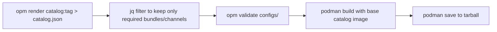

[< Back to main guide](../README.md) | [Prev: oc-mirror](../02-oc-mirror/README.md) | [Next: Upgrade path >](../04-upgrade-path/README.md)

# Building pruned catalog images

Instead of relying on oc-mirror's internal catalog filtering and rebuild, you can build **pruned catalog images** manually. This gives you exact control over which bundles appear in the catalog and avoids d2m issues where oc-mirror tries to reach the source registry to rebuild the catalog (see [d2m troubleshooting](../06-troubleshooting/README.md)).

**When to use this approach:**

- You need a catalog with only specific operator upgrade paths (minimizing what OLM sees and can install)
- You are hitting oc-mirror d2m failures related to catalog rebuild or digest resolution
- You want a portable, self-contained catalog tarball that can be pushed to any registry independently of oc-mirror
- You are serving multiple clusters with different operator versions from one internal registry

**Workflow overview:**



## Step 1: Render the source catalog

```bash
opm render registry.redhat.io/redhat/redhat-operator-index:v4.18 > catalog.json
```

## Step 2: Filter with jq

The filter must handle four FBC object types:

- **`olm.package`** - keep packages you need; override `defaultChannel` to a retained channel
- **`olm.channel`** - keep only channels in your upgrade path:
  - Prune the `entries` array to only kept bundles
  - Strip `replaces` references to bundles not in the catalog (set to null)
  - Keep `skipRange` as-is (it references versions below the current, which are not in the catalog and do not need to be)
- **`olm.bundle`** - keep only the exact bundles you need
- **`olm.deprecations`** - keep only if all referenced bundles exist in the pruned catalog; exclude entries referencing removed bundles (otherwise `opm validate` fails)

Example jq filter for a single-bundle channel (the head):

```bash
jq -c '
select(
  (.schema == "olm.package" and .name == "my-operator")
  or
  (.schema == "olm.channel" and .package == "my-operator" and .name == "stable-2.x")
  or
  (.schema == "olm.bundle" and .name == "my-operator.v2.5.3")
)
|
if .schema == "olm.package" then
  .defaultChannel = "stable-2.x"
elif .schema == "olm.channel" then
  .entries = [.entries[] | select(.name == "my-operator.v2.5.3") | {name, skipRange}]
else . end
' catalog.json > configs/index.json
```

For channels with multiple bundles (e.g. a replaces chain), keep all entries and preserve the `replaces` references between them. Only strip `replaces` on the entry-point bundle (whose `replaces` would reference a bundle outside the catalog).

> [!TIP]
> A helper script [`prune-catalog.sh`](./prune-catalog.sh) is included in this directory. It wraps the jq filter above for simple single-channel cases.

## Step 3: Validate

```bash
opm validate configs/
```

Common validation failures:
- `defaultChannel` points to a removed channel - override it in the `olm.package` entry
- `olm.deprecations` references a removed bundle - exclude the deprecation entry
- Channel entry references a bundle not in the catalog via `replaces` - strip the `replaces` field from that entry

## Step 4: Build the image

Use the original catalog image as the base. It provides the correct `opm` binary, architecture, and RHEL base layers. The [`Dockerfile`](./Dockerfile) in this directory is ready to use:

```Dockerfile
FROM registry.redhat.io/redhat/redhat-operator-index:v4.18
USER 0
RUN rm -rf /configs/*
COPY configs/ /configs
RUN rm -rf /tmp/cache/*
RUN /bin/opm serve /configs --cache-dir=/tmp/cache --cache-only
USER 1001
EXPOSE 50051
ENTRYPOINT ["/bin/opm"]
CMD ["serve", "/configs", "--cache-dir=/tmp/cache"]
```

The `RUN /bin/opm serve ... --cache-only` step pre-builds the pogreb cache at image build time so the catalog pod starts instantly without a cold-cache rebuild.

```bash
podman build --squash-all -f Dockerfile -t redhat-operator-index:v4.18-pruned .
```

> [!IMPORTANT]
> The `--squash-all` flag is required. Without it, the base image layers (which contain the **full original catalog** at up to ~4 GB) remain in the image even though we deleted `/configs/*` in a later layer. Container layers are additive - `RUN rm` only adds whiteout markers; the original data stays in lower layers. `--squash-all` collapses everything into a single layer where deleted files are truly gone, reducing the image from multi-GB to ~1 GB (RHEL base + opm binary + your small pruned catalog).

## Step 5: Save and transfer

```bash
podman save -o redhat-operator-index-v4.18-pruned.tar \
  redhat-operator-index:v4.18-pruned
```

On the air-gapped side:

```bash
podman load -i redhat-operator-index-v4.18-pruned.tar
podman tag localhost/redhat-operator-index:v4.18-pruned \
  internal-registry:5000/redhat/redhat-operator-index:v4.18-pruned
podman push internal-registry:5000/redhat/redhat-operator-index:v4.18-pruned
```

> [!IMPORTANT]
> The pruned catalog image contains only **catalog metadata** (which bundles exist, their upgrade edges, and their `relatedImages` references). You still need to mirror the actual **bundle images and operand images** using oc-mirror with the corresponding ISC. The pruned catalog and the oc-mirror ISC are complementary: the ISC drives the image mirroring; the pruned catalog drives what OLM sees on the cluster.
