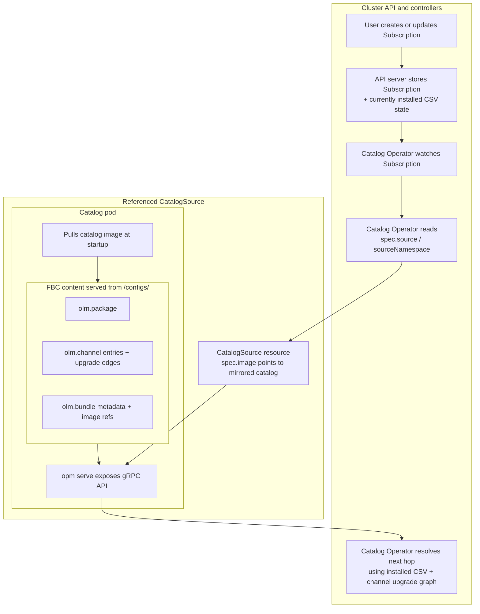
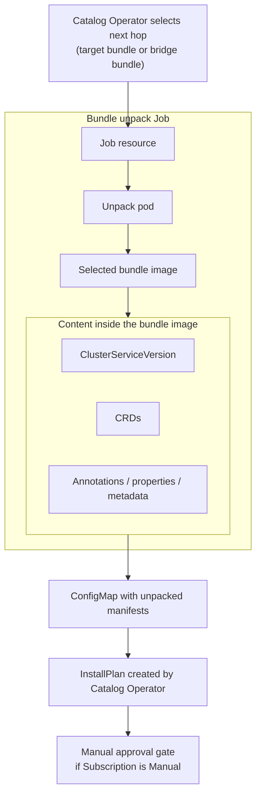
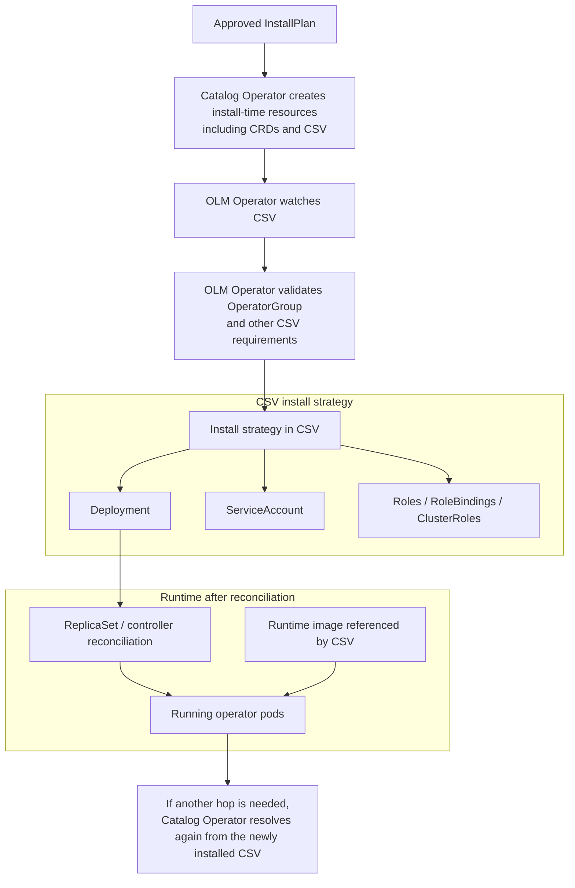

# OpenShift OLM Field Guide for Disconnected Environments

**Last updated:** 2026-07-14 · **Document version:** 1.4

This guide is for Red Hat consultants and customer platform teams who need to mirror and upgrade OLM-based operators in disconnected or air-gapped OpenShift environments.

Disconnected operator upgrades are harder than they should be. Every mirror run has real cost - time, bandwidth, media handling, security review, and change windows - and a failed or oversized run means repeating the entire transfer cycle. There is no room for trial and error.

The official documentation covers supported commands and schemas, but leaves critical decisions to the reader: which bundles to actually mirror, how to compute the minimal upgrade path, and what to do when `oc-mirror` itself hits known issues like d2m catalog rebuild failures. This guide fills those gaps with practical techniques gathered from real disconnected deployments:

- Computing the minimal supported upgrade path by inspecting raw catalog metadata (`replaces`, `skipRange`)
- Building pruned catalog images for exact control over what OLM can see and install
- Working around known d2m failures with `registries.conf` redirects
- Applying generated resources in the tested order so the disconnected cluster behaves as expected

After following this guide, you will be able to compute the minimal supported upgrade path for an operator, mirror only the required content, and apply it on a disconnected cluster with a predictable outcome.

**What this guide is not:**

- A replacement for official product documentation, support policy, or release notes
- A generic Kubernetes operator tutorial
- A promise that one workflow fits every security boundary or customer process

**Table of contents**

- [1. Foundations](#1-foundations) - Terminology, OLM flow, mental model, compatibility matrix
- [2. oc-mirror](#2-oc-mirror) - Setup, workflows (m2d / d2m / m2m), ImageSetConfiguration, pruned catalogs, troubleshooting
- [3. Mirror only required versions](#3-mirror-only-required-versions) - skipRange, `opm render`, path solver
- [4. Install/upgrade with a mirrored catalog](#4-installupgrade-an-existing-operator-with-a-mirrored-catalog) - Cluster-side apply order, catalog retagging, Subscription patching
- [5. References](#5-references)

---

## 1. Foundations

The terminology, installation flow, and mental model below are the core concepts you need before working with catalogs or disconnected mirroring.

### 1.1 Terminology

Terms are ordered to make the flow easier to follow: each concept is introduced before it is used heavily in later sections.

#### 1.1.1 Operator

An **operator** is application-specific automation for Kubernetes (and OpenShift). In practice it is one or more controllers plus API extensions that provide additional functionality to the cluster.

- **Cluster Operators** - Shipped as part of the OpenShift release payload and managed by the **Cluster Version Operator (CVO)**. During cluster installation and cluster upgrades, CVO deploys them as part of the platform lifecycle. You do not install these through OLM.
- **Optional add-on Operators** - Managed by **Operator Lifecycle Manager (OLM)** (detailed in Section 1.1.10). Unlike Cluster Operators, these are selected per environment and installed from catalogs based on your package/channel/subscription choices. This guide primarily targets these OLM-based operators.

#### 1.1.2 Package

A **package** is the top-level product name used to identify an operator offering (for example `advanced-cluster-management`). The next terms explain how that package is represented and delivered.

#### 1.1.3 Bundle (bundle image)

> [!NOTE]
> In this guide, **bundle** means **bundle image** unless explicitly stated otherwise.

A bundle image is one installable operator version, shipped as a non-runnable OCI image. Think of it as a container image used purely as a **delivery envelope for YAML files** - it contains no binaries, no entrypoint, and no running process. During installation, OLM creates an unpack Job that **pulls the bundle image from the container registry**, extracts the YAML manifests from it, and writes them into a `ConfigMap`. OLM does not run the bundle image as a workload.

**Directory layout.** A bundle image has two directories that OLM uses:

- **`manifests/`** - YAML manifests for installation: one ClusterServiceVersion (`CSV`) describing the operator version and install strategy, and one or more `CRD` manifests required by that version.
- **`metadata/`** - Catalog annotations used by tooling, primarily `annotations.yaml` which tells `opm` how to index the bundle into a catalog.

Some bundles include additional directories (e.g. `tests/` for operator scorecard tests), but OLM only reads `manifests/` and `metadata/`.

#### 1.1.4 Channel

A **channel** is an upgrade lane within a package. It is a named sequence of bundle entries and upgrade edges (for example `stable`, `release-2.13`, `latest`). Bundles within a channel are typically versioned as `x.y.z` (major.minor.patch / z-stream).

Publishers use channels to organize upgrade graphs and support streams. A package can expose multiple channels, and a bundle version can appear in more than one channel. In disconnected environments, channels usually matter less as release-cadence labels and more as metadata you must inspect carefully, because they complicate the decision of which bundles you actually need to mirror.

#### 1.1.5 Catalog

A **catalog** is metadata that tells OLM what packages/channels/bundles exist and how upgrades connect (`replaces`, `skipRange`). It contains upgrade-graph metadata and base64-encoded copies of bundle manifests (CSV, CRDs), but it does **not** contain the operator's runtime container images or the bundle images themselves - those are separate OCI images pulled from the registry at install time.

In a **file-based catalog (FBC)**, which is the current JSON/YAML-based catalog format that replaced the older SQLite-backed index format, channel entries reference bundle names and bundle objects include the backing bundle image reference (typically digest-resolved at mirror/install time). That is the "pointer" from package/channel metadata to actual installable content.

In OpenShift, this metadata is stored in an OCI **catalog image** (also called **index image**), commonly from families such as:

- **Red Hat Operators** - `registry.redhat.io/redhat/redhat-operator-index:v4.<minor>`
- **Certified Operators** - `registry.redhat.io/redhat/certified-operator-index:v4.<minor>`
- **Community Operators** - `registry.redhat.io/redhat/community-operator-index:v4.<minor>`

Some older releases and environments may also include **Red Hat Marketplace** (`redhat-marketplace`).

Catalog images are versioned by OCP minor (for example `redhat-operator-index:v4.18`) and are not interchangeable across OCP minors. Modern index images carry **file-based catalog (FBC)** content. The FBC tooling is provided by **`opm`**, described in detail below.

**FBC data structure**

FBC data is a **stream of JSON objects** (one object per entity, concatenated or newline-delimited). Each object has a `schema` field that identifies its type:

- `olm.package` - package definition, including a `defaultChannel` field that determines which channel OLM uses when none is specified
- `olm.channel` - channel definition with an `entries` array; each entry has a bundle name and upgrade edges (`replaces`, `skips`, `skipRange`)
- `olm.bundle` - bundle metadata including the bundle `image` reference, `relatedImages` (operand container images), and `properties` (which include base64-encoded manifests as `olm.bundle.object`)
- `olm.deprecations` - optional deprecation notices targeting specific packages, channels, or bundles

**Example: how FBC objects relate** (from a real `redhat-operator-index:v4.16` render):

```
Package "advanced-cluster-management"
├── defaultChannel: "release-2.14"
├── Channel "release-2.11"
│   ├── entry: "advanced-cluster-management.v2.11.3"
│   │   ├── replaces: "advanced-cluster-management.v2.11.2"
│   │   └── skipRange: ">=2.10.0 <2.11.3"
│   └── entry: "advanced-cluster-management.v2.11.4"
│       ├── replaces: "advanced-cluster-management.v2.11.3"
│       └── skipRange: ">=2.10.0 <2.11.4"
└── Bundle "advanced-cluster-management.v2.11.4"
    ├── image: "registry.redhat.io/.../acm-operator-bundle@sha256:92e05b..."
    └── relatedImages:
        ├── "registry.redhat.io/.../ose-configmap-reloader-rhel9@sha256:5322ff..."
        └── "registry.redhat.io/.../ose-oauth-proxy-rhel9@sha256:eab90e..."
```

The package owns channels, each channel has entries (bundle names + upgrade edges), and each bundle object holds the digest-pinned bundle image reference and the `relatedImages` list (operand images that the operator needs at runtime).

**Catalog image on-disk layout:** Inside the catalog image, FBC data lives under `/configs/`. The primary file is `/configs/index.json` (or multiple files in that directory). When the catalog pod starts, `opm serve /configs` reads these files, optionally uses a prebuilt cache at `/tmp/cache/`, and exposes the content over a gRPC service that OLM queries. This on-disk layout is important to understand because it is the same structure you replicate when building a pruned catalog image manually (see Section 2.11).

```
/
├── bin/opm              # opm binary (entrypoint)
├── configs/
│   └── index.json       # FBC content (JSON stream of olm.* objects)
└── tmp/
    └── cache/           # opm serve cache (pogreb format)
```

Every `olm.package` must have a `defaultChannel` that points to a channel present in the catalog; otherwise `opm validate` fails and OLM cannot serve the catalog. This becomes important when building pruned catalogs (Section 2.11) or filtering with oc-mirror (Section 2.7).

**`opm` (Operator Package Manager)** is a standalone CLI binary from the Operator Framework project. It is the tool used to build, validate, and serve FBC catalogs. Inside catalog images, the `opm` binary lives at `/bin/opm` and acts as the container entrypoint (running `opm serve` to expose catalog data over gRPC). On your workstation, you use it to inspect catalogs offline:

- **`opm render <catalog-image>`** - pulls a catalog image and dumps its FBC content as a stream of JSON objects. This is how you extract the upgrade graph for offline analysis (see Section 3.1).
- **`opm validate <dir>`** - validates FBC data in a directory against the schema. Used when building pruned catalogs (see Section 2.11).
- **`opm serve <dir>`** - starts a gRPC server from FBC data. This is what runs inside catalog pods on the cluster.

You can download `opm` from the [Red Hat Hybrid Cloud Console](https://console.redhat.com/openshift/downloads) (under **OpenShift disconnected installation tools**) or extract it from a catalog image at `/bin/opm`.

Example of rendering and querying a catalog:

```bash
opm render registry.redhat.io/redhat/redhat-operator-index:v4.18 > catalog.json
jq -r 'select(.schema=="olm.channel") | .package, .name' catalog.json
```

#### 1.1.6 `CatalogSource` / `ClusterCatalog`

The cluster needs a Kubernetes resource that points OLM to a catalog image. There are two mechanisms, depending on OCP version:

- **`CatalogSource`** (`operators.coreos.com/v1alpha1`) - Used in OCP 4.x with OLM Classic. When you create a `CatalogSource`, the Catalog Operator creates a **dedicated pod** that pulls the catalog image, runs `opm serve` inside it, and exposes the FBC content over a gRPC service. OLM then queries that pod's gRPC endpoint to resolve packages and bundles.
- **`ClusterCatalog`** (`olm.operatorframework.io/v1`) - Used in newer OCP flows (OCP 4.17+ with OLM v1 / catalogd). Instead of creating a per-catalog pod, the **catalogd** controller pulls the catalog image, extracts the FBC content (`/configs/`), and serves it through its own HTTP API. There is no separate `opm serve` pod per catalog.

Without one of these pointing to your mirrored catalog image, OLM cannot resolve packages or channels for disconnected installs.

#### 1.1.7 `Subscription`

A **`Subscription`** is a Kubernetes resource that expresses: "Install this package from this catalog object on this channel."

Key fields include:

- **Package name** (`name`)
- **Catalog reference** (`source` / `sourceNamespace`)
- **Channel** (`channel`)
- **Approval policy** (`installPlanApproval`: `Automatic` or `Manual`)
- **Optional start point** (`startingCSV`)

Bundle/CSV selection is resolved from channel metadata at runtime: by default OLM resolves to the channel head that satisfies constraints; `startingCSV` can pin the initial target when you need controlled starting behavior.

The Catalog Operator watches `Subscription`s and resolves them to an `InstallPlan`.

#### 1.1.8 `InstallPlan`

An **`InstallPlan`** is a Catalog Operator resource listing what should be installed for a resolved subscription.

- **Approval** - Manual subscriptions require explicit approval (`spec.approved: true`).
- **Execution** - The Catalog Operator executes approved plans and creates resources such as `CRD`s and `CSV`s.
- **History** - InstallPlans remain as an audit/history trail.

#### 1.1.9 `OperatorGroup`

An **`OperatorGroup`** tells OLM **which namespaces an operator is allowed to watch and manage**. Without an `OperatorGroup` in the operator's install namespace, OLM refuses to run the CSV's install strategy.

**Why it exists:** A single cluster can have many operators installed in different namespaces. The `OperatorGroup` prevents scope conflicts - it defines the "tenant boundary" so two operators don't accidentally manage the same namespace or create conflicting RBAC.

**Three modes:**

- **AllNamespaces** - The operator watches all namespaces. Used for cluster-wide operators like ACM, GitOps, or compliance operators. The `spec.targetNamespaces` list is left empty (or omitted entirely).
- **SingleNamespace** - The operator watches only its own namespace. The `spec.targetNamespaces` list contains exactly one namespace.
- **MultiNamespace** - The operator watches a specific set of namespaces. The `spec.targetNamespaces` list contains multiple entries.

> [!TIP]
> An empty `targetNamespaces` list is not the same as no `OperatorGroup`. The resource itself must exist in the install namespace - OLM checks for its presence, not just its content.

**In practice:** Most Red Hat operators use AllNamespaces mode. When you install an operator through OperatorHub, OCP creates the `OperatorGroup` automatically in the install namespace. In disconnected environments where you create the `Subscription` manually, verify an `OperatorGroup` exists in the target namespace - if it is missing, OLM will not proceed past the `InstallPlan` phase.

#### 1.1.10 Operator Lifecycle Manager (OLM)

With the objects above in place, OLM controllers do the orchestration:

- **Catalog Operator** - Watches `CatalogSource`/`ClusterCatalog`, `Subscription`, and `InstallPlan`; resolves bundles and executes approved install plans.
- **OLM Operator** - Watches `CSV`s and runs the CSV install strategy to create/update runtime resources (`Deployment`, RBAC, etc.).

You will typically see `catalog-operator` and `olm-operator` pods in the `openshift-operator-lifecycle-manager` namespace (verify with `oc get pods -n openshift-operator-lifecycle-manager`).

---

### 1.2 OLM installation flow (Subscription to running operator)

When you create a `Subscription`, OLM does not immediately start operator pods. It first resolves *what* should be installed, then unpacks the selected bundle, creates the install resources, and only then starts the runtime workload.

The diagrams below break that sequence into stages. Each stage includes a short explanation first, and the diagram is there to show both the control flow and the important containment relationships inside the catalog pod, unpack Job, and runtime resources. Component names (Catalog Operator vs OLM Operator) match OpenShift's actual controllers.

**Stage 1: Subscription to graph resolution**

The first stage is about **resolution**, not installation. The `Subscription` points to a `CatalogSource` (or `ClusterCatalog`). The **Catalog Operator** reads that reference and queries the catalog's package/channel data to find the next upgrade hop. The diagram below shows the `CatalogSource` flow (dedicated catalog pod running `opm serve`). With `ClusterCatalog`, the catalogd controller serves the same data without a per-catalog pod (see Section 1.1.6).



**Stage 2: Selected bundle to InstallPlan**

Once the next hop is chosen, the **Catalog Operator** creates a bundle unpack Job for that specific selected bundle, whether it is the final target or an intermediate bridge. The unpack Job pulls the **bundle image** from the container registry, extracts the manifests (CSV, CRDs) from it, and writes the unpacked content into a `ConfigMap`. The **Catalog Operator** then reads that `ConfigMap` and builds the `InstallPlan`.

> [!NOTE]
> FBC catalogs embed bundle manifests as base64 `olm.bundle.object` properties, but the catalog gRPC service **strips** this embedded data from API responses when the bundle has an `image` reference (which all standard Red Hat bundles do). OLM therefore always pulls the actual bundle image via the unpack Job. The embedded data exists for the OpenShift console, package-server, and tooling, not for installation.

> [!IMPORTANT]
> **Bundle images must be present in your mirror registry.** OLM pulls one bundle image per upgrade hop. If a bundle image is missing from the registry, the unpack Job fails and the upgrade stalls.



**Stage 3: InstallPlan to running operator**

After approval, the **Catalog Operator** executes the `InstallPlan` and creates the install-time API resources for that hop. Then the **OLM Operator** takes over, reconciles the `CSV`, runs the install strategy, and creates the runtime resources that Kubernetes uses to start the actual operator pods. If the upgrade needs another hop, the process returns to Stage 1 and resolves again from the newly installed CSV.



**Key distinctions:**

- A `CSV` must be an active member of an `OperatorGroup` before the OLM Operator runs install strategy.
- The bundle image is used only for *unpacking* (manifests to `ConfigMap`). The **operator's runtime container image** (referenced in the `CSV`'s `Deployment` spec) is what actually runs in the operator pods.

---

### 1.3 Mental model

| Concept                                | One-line mental model                                                                                                     |
| -------------------------------------- | ------------------------------------------------------------------------------------------------------------------------- |
| **Operator**                           | Application automation (controllers + APIs). OLM-based = optional add-on managed by OLM.                                  |
| **Package**                            | One operator product in a catalog (e.g. advanced-cluster-management).                                                     |
| **Bundle image**                       | One installable operator version packaged as a non-runnable OCI image containing manifests and metadata.                  |
| **Channel**                            | Upgrade track inside a package (e.g. stable, release-2.13).                                                               |
| **Catalog image**                      | OCI image holding package/channel/bundle metadata and upgrade edges for a specific OCP minor.                             |
| **`CatalogSource` / `ClusterCatalog`** | Cluster object that tells OLM where to read a catalog image from.                                                         |
| **`Subscription`**                     | "Install this package from this catalog object on this channel."                                                          |
| **`InstallPlan`**                      | Catalog Operator's actionable plan generated from a resolved subscription.                                                |
| **`OperatorGroup`**                    | Namespace scope/tenancy guardrail for operator installation and watch targets.                                            |
| **`CSV`**                              | Installable operator-version record that defines install strategy and required APIs.                                      |
| **OLM**                                | Catalog Operator resolves + executes approved plans; OLM Operator reconciles CSV install strategy into runtime resources. |

### 1.4 Operator compatibility matrix

Before deciding which operator versions to mirror, check the **Red Hat Operator Supportability and Interoperability Guide** at:

> <https://access.redhat.com/support/policy/updates/openshift_operators>

This page lists each operator's supported versions, the OCP versions they run on, general availability dates, and full-support/maintenance end dates. It is the authoritative source for deciding which operator version is valid for a given OCP minor.

**Key concepts:**

- **Platform Aligned** operators (e.g. ACM, MCE) are version-locked to specific OCP minors. Each operator minor supports a narrow OCP range (typically 3-4 minors). Upgrading OCP beyond that range requires upgrading the operator first.
- **Platform Agnostic** operators (e.g. OpenShift GitOps, Gatekeeper) support wider OCP ranges and are more flexible across OCP upgrades.
- **Rolling Stream** operators (e.g. OpenShift Update Service / Cincinnati) have a single long-lived version that tracks many OCP minors.

**Using the matrix for upgrade planning:**

1. Look up your operator in the matrix. Find the row for your currently installed version and confirm it supports your current OCP version.
2. Find the latest version that supports your current OCP version (this is your phase-1 target if you need to upgrade the operator before upgrading OCP).
3. Find the version that supports your target OCP version (this is your phase-2 target).
4. Verify there is a version that spans both your current and target OCP versions, so you can bridge the OCP upgrade without the operator running unsupported.
   - If no single version spans both, you need an intermediate OCP hop where you upgrade the operator first.

> [!WARNING]
> In some cases, teams accept the risk of temporarily running an operator on an unsupported OCP version (the operator still functions but Red Hat cannot provide support for that combination). If you are considering this, consult with Red Hat support beforehand and document the risk window in your change plan.

**Example:** If ACM 2.13 supports OCP 4.16-4.19 and ACM 2.15 supports OCP 4.18-4.21, then on OCP 4.18 you can upgrade ACM from 2.13 to 2.15, and then safely upgrade OCP to 4.20 while ACM 2.15 still supports it.

**Version-paired operators:** Some operators are version-paired (e.g. ACM and MCE). The compatibility matrix shows each independently, but they must be upgraded together. Always cross-reference both operators when planning upgrades. The pairing is documented in the product release notes (for example ACM 2.13 pairs with MCE 2.8, ACM 2.15 pairs with MCE 2.10, ACM 2.17 pairs with MCE 2.17).[Fix - make this a warning as well?] [Fix - maybe add another warning that sometimes the default channel of a catalog does not correspond to the compatability matrix? e.g. catalog of 4.20 has the default channel - stable-3.x for operator foo but 4.20 is compatiable with stable-2.x...]


---

## 2. oc-mirror

Key terms (Operator, Package, Catalog, ImageSetConfiguration, etc.) are defined in **Section 1**. This section covers how to set up, configure, and run oc-mirror for disconnected mirroring workflows.

### 2.1 What oc-mirror does

oc-mirror uses a single declarative **ImageSetConfiguration** file to decide what to copy. It can mirror:

- **Platform (OCP) release images and update graph** - For installing or upgrading the cluster itself in a disconnected way.
- **Operator catalogs** - Catalog images (index images) and the bundle images they reference, so OLM on the disconnected cluster can install and upgrade operators.
- **Additional images** - Arbitrary OCI images that your workloads need and that are not part of OLM.

The tool does not install or configure the cluster; it only copies images and generates manifests (e.g. `ImageDigestMirrorSet`, `ImageTagMirrorSet`, `CatalogSource`, `ClusterCatalog`, and when mirroring platform content, `UpdateService`) that you apply on the cluster so it uses your internal registry.

### 2.2 Workflows: m2d, d2m, m2m

Three workflows cover different connectivity patterns:

| Workflow                   | When to use                                                    | What happens                                                                                                                                                                                     |
| -------------------------- | -------------------------------------------------------------- | ------------------------------------------------------------------------------------------------------------------------------------------------------------------------------------------------ |
| **m2d (mirror-to-disk)**   | You have a connected host.                                     | oc-mirror pulls images from the source (e.g. `registry.redhat.io`) and writes them as tarballs to a local directory. You then move that directory (e.g. via removable media) across the air-gap. |
| **d2m (disk-to-mirror)**   | You are on the air-gapped side with the tarballs.              | oc-mirror reads the tarballs and pushes the images to your internal registry. No internet access required.                                                                                       |
| **m2m (mirror-to-mirror)** | A host can reach both the internet and your internal registry. | oc-mirror copies directly from the source registry to your registry. No tarballs or physical transfer.                                                                                           |

**Destination prefixes:** For **m2d** the destination uses the `file://` prefix (local directory). For **d2m** and **m2m** the destination uses the `docker://` prefix (container registry).

For a full air-gap, you typically run **m2d** on a connected machine, transfer the tarballs, then run **d2m** on a host inside the secure network. If you have a bastion that can see both sides, **m2m** avoids the intermediate disk step. It can also be used for internal-to-internal promotion when the host can reach both source and destination registries with valid credentials for each.

**Internal cache registry:** Across all workflows, oc-mirror runs an **embedded container registry** on `localhost:55000` (configurable with `--port`) that acts as a local image cache. During m2d, pulled images are stored in this cache before being archived into tarballs. During d2m, the tarball is extracted into this cache, and images are pushed from it to the destination registry. This cache registry is transient - it runs only while oc-mirror is active and is not exposed outside the host. Understanding this is important for the d2m troubleshooting workaround in Section 2.12.

### 2.3 Set up oc-mirror

#### 2.3.1 Obtain the binary

Download oc-mirror from the [Red Hat Hybrid Cloud Console](https://console.redhat.com/openshift/downloads): **OpenShift disconnected installation tools** → **OpenShift Client (oc) mirror plugin** → choose your OS and architecture → Download.

> [!NOTE]
> On **aarch64**, **ppc64le**, and **s390x**, oc-mirror v2 is supported only for OpenShift Container Platform 4.14 and later.

The binary is not tied to a single OCP minor version. The coupling to a specific release is in your **ImageSetConfiguration** (e.g. which catalog image tag you use, such as `redhat-operator-index:v4.18`). Use the build that your OpenShift toolchain policy expects and confirm behavior with:

```bash
oc-mirror --v2 --help
```

#### 2.3.2 Standalone vs plugin

You will see both `oc-mirror` and `oc mirror` in documentation. They use the same binary:

- **Standalone** - The executable is named `oc-mirror`. Run it by path (e.g. `./oc-mirror`). No `oc` CLI is required. Useful on a jump host used only for mirroring.
- **Plugin** - If `oc-mirror` is on your `PATH`, the OpenShift CLI (`oc`) invokes it when you run `oc mirror`. One command for both cluster operations and mirroring.

#### 2.3.3 Use v2

> [!WARNING]
> oc-mirror v1 was deprecated in OCP 4.18 and will be removed in a future release. Use **v2** for all mirroring (m2d, d2m, m2m).

- Pass `--v2` on the command line.
- Use `apiVersion: mirror.openshift.io/v2alpha1` in your ImageSetConfiguration.

Quick exploration examples:

```bash
# List available packages in a catalog
oc-mirror --v2 list operators \
  --catalog=registry.redhat.io/redhat/redhat-operator-index:v4.18

# List channels for a package
oc-mirror --v2 list operators \
  --catalog=registry.redhat.io/redhat/redhat-operator-index:v4.18 \
  --package=advanced-cluster-management

# List versions in a specific channel
oc-mirror --v2 list operators \
  --catalog=registry.redhat.io/redhat/redhat-operator-index:v4.18 \
  --package=advanced-cluster-management \
  --channel=release-2.13
```

#### 2.3.4 Authentication

oc-mirror must authenticate to `registry.redhat.io` (and optionally other registries). It does **not** require Podman or Docker at runtime; it is a self-contained binary that uses the `containers/image` library. It does require a valid **auth file** in a format that library understands.

**Default auth file location:** `${XDG_RUNTIME_DIR}/containers/auth.json` (documented default for `--authfile`). The underlying `containers/image` library also falls back to `~/.docker/config.json` if the primary location is absent, but this is a library-level fallback, not a documented oc-mirror default.

If your system uses another path (e.g. `~/.config/containers/auth.json` on some Podman setups), pass `--authfile` explicitly so oc-mirror finds the file.

**How to populate the auth file:**

1. **If Podman is available:** Run `podman login registry.redhat.io`. This writes credentials to a path oc-mirror can use (or that you can point to with `--authfile`).
2. **If not:** Download your [pull secret](https://console.redhat.com/openshift/install/pull-secret) from the Red Hat Hybrid Cloud Console. The file is valid JSON with an `auths` key; save it as `auth.json` (or another path and pass `--authfile`).

Example with an explicit auth file:

```bash
oc-mirror --authfile /etc/mirror/pull-secret --config config.yaml file:///mirror-dir --v2
```

### 2.4 What you need before mirroring

The following checklist summarizes prerequisites from the sections above. Confirm each item before starting a mirror run:

1. **ImageSetConfiguration** - A YAML file (e.g. `config.yaml`) that specifies what to mirror: platform channels, operator catalogs and packages/channels/versions, and any additional images. See Section 2.7 for how to define it.
2. **Destination** - For **m2d**: a local directory path with the `file://` prefix (e.g. `file:///mnt/usb/mirror-dir`). For **d2m** or **m2m**: a registry URL with the `docker://` prefix (e.g. `docker://registry.example.com:5000`).
3. **Credentials** - Auth file for the source registry (and for d2m/m2m, access to the destination registry as needed).

After a successful run, oc-mirror writes tarballs (m2d) and/or pushes images (d2m, m2m) and generates cluster resources (mirror sets, `CatalogSource` or `ClusterCatalog`, etc.) that you apply on the cluster so it uses the mirrored content.

### 2.5 Resilient run flags

Long mirror runs can fail on slow or flaky links. Two flags improve reliability:

- **`--retry-times N`** - How many times to retry a failed image pull before giving up. The v2 README default is `2`; for production or unreliable networks, use at least `5`. The only cost is extra wait time on repeated failures.
- **`--image-timeout D`** - Per-image timeout as a Go duration (`10m`, `30m`, `1h`). Default is `10m0s`, which can be too short for large operator bundles on a slow link. Use `1h` when pulling through a throttled or unstable connection.

Example production-style m2d command:

```bash
oc-mirror \
  --config imagesetconfig.yaml \
  file:///mnt/usb/mirror-dir \
  --v2 \
  --retry-times 5 \
  --image-timeout 1h \
  --authfile /etc/mirror/auth.json
```

### 2.6 Workspace vs cache

Do not confuse these two directories:

**Workspace** - The `file://` path you pass on the command line.

- For **m2d**, it holds tarballs (`mirror_seq*.tar`) and `working-dir/` (metadata, sequence state, cluster-resources).
- For **m2m**, it holds only metadata (no tarballs).
- Only the tarballs cross the air-gap. `working-dir/` is recreated from the tarballs when you run d2m on the other side.

**Cache** - An internal directory (default under `$HOME`; override with `--cache-dir`) where oc-mirror stores blobs and metadata for performance.

- It is separate from the workspace. Do not transfer the cache across the air-gap.
- Deleting it does not delete your tarballs; the next run will re-download what it needs.
- If local disk is full, clearing the cache is a valid recovery action.

### 2.7 ImageSetConfiguration

The ImageSetConfiguration is the single YAML file that tells oc-mirror what to mirror. It can also include **Helm** repositories and local charts (see the [oc-mirror README](https://github.com/openshift/oc-mirror/blob/main/README.md) for the schema). Correct configuration keeps runs small and predictable.

**Minimal structure:**

```yaml
kind: ImageSetConfiguration
apiVersion: mirror.openshift.io/v2alpha1
mirror:
  platform:
    channels:
      - name: stable-4.18
        minVersion: 4.18.1
        maxVersion: 4.18.1
    graph: true
  operators:
    - catalog: registry.redhat.io/redhat/redhat-operator-index:v4.18
      packages:
        - name: compliance-operator
          channels:
            - name: stable
              minVersion: 1.7.0
  additionalImages:
    - name: quay.io/example/my-app:latest
```

**Operators stanza (read left to right):** `catalog` → which index; `packages[].name` → which operator; `channels[].name` → which channel; `minVersion` / `maxVersion` → which versions. If you omit a level, oc-mirror chooses for you, which often leads to oversized mirrors.

**Channel names** are publisher-defined labels (e.g. `release-2.13`, `stable`, `latest`). There is no global convention. In disconnected environments, treat a channel primarily as an **upgrade-graph identifier**, not as a release-cadence promise. Prefer explicit stream channels when they exist (for example `release-2.13`, `stable-2.9`, `v1.0.x`) and avoid relying on generic aliases such as `stable` or `latest` unless the vendor documents them for your version.

**minVersion / maxVersion:**

- Omitting `maxVersion` keeps the lower bound while allowing newer z-stream content in later runs.
- Omitting both typically mirrors channel head behavior for the selected scope.
- If you set version bounds but do not name a channel, oc-mirror can use the package **default channel**, which is sometimes not the one supported for your OCP version. Always name the channel explicitly.
- If your filtered channel set excludes the upstream package default, use the package `defaultChannel` field in the ImageSetConfiguration so the filtered catalog remains internally consistent.

Validate on your exact binary with `oc-mirror --v2 --help`.

**Default channel requirement:** Every filtered catalog must have a valid `defaultChannel` for each package. If your ISC's channel list excludes the upstream package default, you **must** set `packages.defaultChannel` to one of the retained channels. Omitting it causes a hard error at filter time:

```
the default channel "<original>" was filtered out, a new default channel must be configured for this package
```

This error comes from the `catalog-filter` library that oc-mirror v2 uses internally. The behavior is deterministic:

| ISC `defaultChannel` | Catalog original in filtered set? | Result |
|----------------------|-----------------------------------|--------|
| Set to a retained channel | N/A | Override applied; original ignored |
| Omitted | Yes | Original kept; no error |
| Omitted | No (filtered out) | **Hard error** - mirror refuses to proceed |

Setting `defaultChannel` does **not** cause that channel to be mirrored. It only overrides the metadata in the filtered `olm.package` entry. The channel must also appear in the `channels` list (or `channels` must be omitted entirely to include all channels).

> [!TIP]
> Always set `defaultChannel` explicitly in the ISC when specifying channels. It costs nothing and prevents failures when the upstream catalog's default does not match your channel selection. The `resolve-operator-path.sh` script handles this automatically.

When in doubt, use `--dry-run` to validate your ImageSetConfiguration before committing to a full mirror run.

**additionalImages** - For non-operator OCI images (e.g. app base images) that must be available in the disconnected environment. Plain image copies; no OLM semantics.

> [!WARNING]
> You must use **explicit registry hostnames** for every image listed under `additionalImages` (e.g. `quay.io/org/image:tag` or `registry.redhat.io/ubi8/ubi:latest`). Otherwise oc-mirror v2 mirrors them to incorrect target paths silently.

> [!TIP]
> For advanced version-selection workflows (`skipRange`, `opm render`, and the path solver script), see **Section 3**.

### 2.8 Running m2d, d2m, and m2m

**m2d (connected):** Destination is `file:///path/to/mirror-dir`. Output includes `mirror_seq1_000000.tar` (and more for large runs) plus `working-dir/` (metadata, sequence state, cluster-resources). [Fix - I am not sure that it is seq1_00000.tar.... double check]

Transfer **only the tarballs**; leave `working-dir/` behind. It is regenerated when you run d2m.

| What              | Transfer? |
| ----------------- | --------- |
| `mirror_seq*.tar` | **Yes**   |
| `working-dir/`    | **No**    |

**d2m (air-gapped):** Copy tarballs to the host. The `--from` argument must point to the directory that *contains* the `mirror_seq*.tar` files (not to `working-dir/`). Then:

```bash
oc-mirror --config imagesetconfig.yaml \
  --from file:///path/to/mirror-dir \
  docker://airgapped-registry:5000 \
  --v2 --retry-times 3
```

oc-mirror reads the tarballs from that directory, recreates `working-dir/` locally, and pushes the images to the registry.

> [!IMPORTANT]
> **The `--config` flag is mandatory for d2m**, even though the ISC is embedded inside the tarball. The tarball contains both the original ISC (as `isc_{timestamp}` at the tar root) and a pinned copy (`working-dir/isc_pinned_{timestamp}.yaml`), but d2m deliberately ignores the embedded copies. The `--config` ISC drives `CollectAll`, which determines what actually gets pushed - d2m does not push everything in the archive.

**Subset push: using a smaller ISC for d2m.** You can pass a different (smaller) ISC during d2m to push only a subset of what the tarball contains. The operator collector only processes operators listed in the ISC; any operators in the archive but not in the ISC are silently skipped. This is useful when a single m2d run mirrors content for multiple clusters or environments, but each d2m run targets a specific scope.

```
m2d --config full.yaml          → tarball has 5 operators + platform images
d2m --config subset-a.yaml      → pushes only 2 of those operators
d2m --config subset-b.yaml      → pushes 3 others (same tarball, separate run)
```

The same applies to `mirror.platform`, `additionalImages`, and `helm` sections - omitting a section from the d2m ISC means that content is not pushed even if it is in the archive.

> [!CAUTION]
> Do not change the package/channel/version filters for an operator between m2d and d2m. d2m reuses pre-built catalog metadata from `working-dir/` by matching a hash of the operator's ISC entry. If the hash does not match (because you changed `minVersion`, added a channel, etc.), d2m attempts to re-filter the catalog, which can fail in a disconnected environment. The safe pattern is: start from the `isc_pinned_{timestamp}.yaml` that m2d generated (it is inside `working-dir/` after unarchive) and **remove** entries you do not need, rather than modifying filter parameters.

**m2m (bastion):** Use `--workspace file:///path/to/workspace` and a `docker://` destination. No tarballs; content goes straight to the registry. The workspace holds only metadata. [Fix - why is it here?]
[Fix - I am pretty sure subset d2m will always fail with oc-mirror trying to go out to find the catalog but fail in disconnected. this will require the bastion ICSP shit...]

**Incremental runs:** oc-mirror tracks state. Running m2d again with the same workspace mirrors only what changed. Use `--since YYYY-MM-DD` to restrict to content newer than a date. Delete the workspace only when you need a full reseed.

> [!TIP]
> For the cluster-side apply order, catalog retagging, and `Subscription` switch logic after mirroring, see **Section 4**.

### 2.9 End-to-end operator upgrade (summary)

1. Determine the minimal mirror set (e.g. `opm render` + path solver or skipRange inspection).
2. Write the ImageSetConfiguration (catalog image for your OCP minor, package, channel from support matrix, minVersion/maxVersion as needed).
3. Run m2d with `--v2 --retry-times 5 --image-timeout 1h` (and `--authfile` if needed).
4. Transfer only `mirror_seq*.tar` to the air-gapped side.
5. Run d2m with `--from file:///path/to/tarballs` and `docker://your-registry`.
6. Apply cluster resources in order (see Section 4):
   - Apply `ImageDigestMirrorSet` and `ImageTagMirrorSet`.
   - Wait for Machine Config Pool (MCP) rollout to complete.
   - Apply signature `ConfigMap` (only if you mirrored release images).
   - Apply catalog and `UpdateService` manifests.
7. Update the `Subscription` (channel, source, `installPlanApproval`, `startingCSV` if desired) and approve the `InstallPlan`.

### 2.10 Delete subcommand and catalog pinning

**Deleting images from the mirror registry:** oc-mirror v2 does not auto-prune. To remove images you no longer need, use the `oc-mirror delete` subcommand in two phases:

1. Run with a `DeleteImageSetConfiguration` and `--generate` to produce a delete-images YAML.
2. Run `oc-mirror delete --delete-yaml-file <path>` to remove manifests from the registry.

Only manifests are deleted; run your registry's **garbage collector** to reclaim blob storage. See the [Disconnected environments documentation](https://docs.redhat.com/en/documentation/openshift_container_platform/4.18/html-single/disconnected_environments/#delete-mirror-registry-content) for the full procedure.

**Catalog pinning:** After m2d or m2m runs, oc-mirror can write pinned configs (`isc_pinned_{timestamp}.yaml` and `disc_pinned_{timestamp}.yaml`) in the working directory. These reference catalogs by digest for reproducible mirrors and for use with the delete flow. See the [oc-mirror README - Catalog Pinning](https://github.com/openshift/oc-mirror/blob/main/README.md).

### 2.11 Building pruned catalog images

Instead of relying on oc-mirror's internal catalog filtering and rebuild, you can build **pruned catalog images** manually. This gives you exact control over which bundles appear in the catalog and avoids d2m issues where oc-mirror tries to reach the source registry to rebuild the catalog (see Section 2.12).

**When to use this approach:**

- You need a catalog with only specific operator upgrade paths (minimizing what OLM sees and can install)
- You are hitting oc-mirror d2m failures related to catalog rebuild or digest resolution
- You want a portable, self-contained catalog tarball that can be pushed to any registry independently of oc-mirror
- You are serving multiple clusters with different operator versions from one internal registry

**Workflow overview:**


**Step 1: Render the source catalog**

```bash
opm render registry.redhat.io/redhat/redhat-operator-index:v4.18 > catalog.json
```

**Step 2: Filter with jq**

The filter must handle four FBC object types:

- **`olm.package`** - keep packages you need; override `defaultChannel` to a retained channel
- **`olm.channel`** - keep only channels in your upgrade path:
  - Prune the `entries` array to only kept bundles
  - Strip `replaces` references to bundles not in the catalog (set to null)
  - Keep `skipRange` as-is (it references versions below the current, which are not in the catalog and do not need to be)
- **`olm.bundle`** - keep only the exact bundles you need
- **`olm.deprecations`** - keep only if all referenced bundles exist in the pruned catalog; exclude entries referencing removed bundles (otherwise `opm validate` fails)

Example jq filter for a single-bundle channel (the head):

```bash
jq -c '
select(
  (.schema == "olm.package" and .name == "my-operator")
  or
  (.schema == "olm.channel" and .package == "my-operator" and .name == "stable-2.x")
  or
  (.schema == "olm.bundle" and .name == "my-operator.v2.5.3")
)
|
if .schema == "olm.package" then
  .defaultChannel = "stable-2.x"
elif .schema == "olm.channel" then
  .entries = [.entries[] | select(.name == "my-operator.v2.5.3") | {name, skipRange}]
else . end
' catalog.json > configs/index.json
```

For channels with multiple bundles (e.g. a replaces chain), keep all entries and preserve the `replaces` references between them. Only strip `replaces` on the entry-point bundle (whose `replaces` would reference a bundle outside the catalog).

**Step 3: Validate**

```bash
opm validate configs/
```

Common validation failures:
- `defaultChannel` points to a removed channel → override it in the `olm.package` entry
- `olm.deprecations` references a removed bundle → exclude the deprecation entry
- Channel entry references a bundle not in the catalog via `replaces` → strip the `replaces` field from that entry

**Step 4: Build the image**

Use the original catalog image as the base. It provides the correct `opm` binary, architecture, and RHEL base layers:

```Dockerfile
FROM registry.redhat.io/redhat/redhat-operator-index:v4.18
USER 0
RUN rm -rf /configs/*
COPY configs/ /configs
RUN rm -rf /tmp/cache/*
RUN /bin/opm serve /configs --cache-dir=/tmp/cache --cache-only
USER 1001
EXPOSE 50051
ENTRYPOINT ["/bin/opm"]
CMD ["serve", "/configs", "--cache-dir=/tmp/cache"]
```

The `RUN /bin/opm serve ... --cache-only` step pre-builds the pogreb cache at image build time so the catalog pod starts instantly without a cold-cache rebuild.

```bash
podman build --squash-all -f Dockerfile -t redhat-operator-index:v4.18-pruned .
```

> [!IMPORTANT]
> The `--squash-all` flag is required. Without it, the base image layers (which contain the **full original catalog** at up to ~4 GB) remain in the image even though we deleted `/configs/*` in a later layer. Container layers are additive - `RUN rm` only adds whiteout markers; the original data stays in lower layers. `--squash-all` collapses everything into a single layer where deleted files are truly gone, reducing the image from multi-GB to ~1 GB (RHEL base + opm binary + your small pruned catalog).

**Step 5: Save and transfer**

```bash
podman save -o redhat-operator-index-v4.18-pruned.tar \
  redhat-operator-index:v4.18-pruned
```

On the air-gapped side:

```bash
podman load -i redhat-operator-index-v4.18-pruned.tar
podman tag localhost/redhat-operator-index:v4.18-pruned \
  internal-registry:5000/redhat/redhat-operator-index:v4.18-pruned
podman push internal-registry:5000/redhat/redhat-operator-index:v4.18-pruned
```

> [!IMPORTANT]
> The pruned catalog image contains only **catalog metadata** (which bundles exist, their upgrade edges, and their `relatedImages` references). You still need to mirror the actual **bundle images and operand images** using oc-mirror with the corresponding ISC. The pruned catalog and the oc-mirror ISC are complementary: the ISC drives the image mirroring; the pruned catalog drives what OLM sees on the cluster.

### 2.12 d2m troubleshooting: catalog resolution and `registries.conf`

A known class of d2m failures involves oc-mirror trying to reach the source registry (`registry.redhat.io`) during the disk-to-mirror phase, which should be fully offline. The typical error is:

```
error: collect catalog "registry.redhat.io/redhat/redhat-operator-index:v4.18":
  pinging container registry registry.redhat.io:
  dial tcp: lookup registry.redhat.io: no such host
```

**Root causes:**

1. **Version mismatch between m2d and d2m binaries.** The tarball's `working-dir/` metadata was written by an older oc-mirror that uses a different layout. The newer d2m binary cannot find the filtered catalog metadata and falls back to pulling from the source registry. **Fix:** use the same oc-mirror binary version for both m2d and d2m.

2. **Race condition during m2d (OCPBUGS-81712).** If the catalog tag is resolved to different digests during the collection and mirroring phases of m2d (because Red Hat updated the tag between the two calls), the tarball contains inconsistent data. **Fix:** update to the latest oc-mirror binary, which pins catalog digests at the start of m2d.

3. **Incomplete m2d run.** The tarball is missing filtered catalog metadata because m2d did not complete catalog filtering. The d2m `filterOperator` code path falls through to `EnsureCatalogInOCIFormat`, which tries `docker://registry.redhat.io/...`. **Fix:** re-run m2d to completion, or use the `registries.conf` workaround below.

**Workaround with `registries.conf`:**

If you have an existing tarball and cannot re-run m2d, you can redirect the failing registry call to oc-mirror's own local cache. During d2m, oc-mirror extracts the tarball into a local embedded registry at `localhost:55000` (default port). A `registries.conf` file can redirect `registry.redhat.io` to that local cache:

```toml
[[registry]]
  location = "registry.redhat.io"
  insecure = true
  [[registry.mirror]]
    location = "localhost:55000"
    insecure = true
```

Apply it via environment variable:

```bash
CONTAINERS_REGISTRIES_CONF=/path/to/registries.conf \
oc-mirror --config isc.yaml \
  --from file:///path/to/archive/ \
  docker://internal-registry:5000 \
  --v2
```

This works because the catalog image is already in the local cache (loaded from the tarball during the unarchive step). The `registries.conf` redirect makes the failing resolution call hit the local cache instead of the internet.

> [!NOTE]
> There is no `--registries-conf` CLI flag in oc-mirror v2. The `CONTAINERS_REGISTRIES_CONF` environment variable is the mechanism. If unset, the `containers/image` library checks standard paths (`/etc/containers/registries.conf`, then `$HOME/.config/containers/registries.conf`).

## 3. Mirror only required versions

The practical objective is to compute the **minimal logical upgrade path** from your current version to your supported target version. That path is derived from the catalog's upgrade edges (`replaces`, `skips`, `skipRange`). Whether stock oc-mirror can represent that path *exactly* is a second question; in practice, the generated ImageSetConfiguration often uses `minVersion` to approximate the exact path with a floating channel head (meaning newer z-stream patches released after your mirror run may also be included).

> [!NOTE]
> If you hear "`skipVersion`" in conversation, read it as `skipRange` in FBC metadata. There is no `skipVersion` field.

### 3.1 Render the catalog to JSON

The catalog image (e.g. `redhat-operator-index:v4.18`) contains FBC data (package definitions, channel definitions, and bundle metadata including upgrade edges) but it is not directly queryable from the command line. To inspect upgrade paths, you need to **render** the catalog to a local JSON file.

**`opm`** (Operator Package Manager) is the Operator Framework tool for building and inspecting FBC catalogs. Running `opm render` pulls the catalog image and outputs a stream of JSON objects (one per FBC entity: `olm.package`, `olm.channel`, `olm.bundle`). Channel objects include `entries` with bundle names and their `replaces` / `skipRange`; bundle objects include the bundle image reference.

> [!TIP]
> **Pruned render:** A raw `opm render` dump includes `olm.bundle` objects with base64-encoded manifests that account for over 90% of the file size (e.g. ~1.1 GB for `redhat-operator-index:v4.16`). The path solver and the manual `jq` queries in this guide only need `olm.package` and `olm.channel` objects. Pipe through `jq` to strip the rest:

```bash
opm render registry.redhat.io/redhat/redhat-operator-index:v4.18 \
  | jq -c 'if .schema == "olm.package" or .schema == "olm.channel" then . else empty end' \
  > catalog.json
```

This produces a file of ~830 KB instead of ~1.1 GB, and the path solver runs in under 2 seconds instead of 30. All examples below assume you have a `catalog.json` produced this way.

### 3.2 Doing it manually (without the path solver script)

You can compute the minimal logical path and write the ImageSetConfiguration by hand:

1. **Render the catalog** using the pruned pipeline from Section 3.1 (if you have not already).

2. **List channels for your package** (replace `PACKAGE` with e.g. `advanced-cluster-management`):

   ```bash
   jq -r 'select(.schema=="olm.channel" and .package=="PACKAGE") | .name' catalog.json
   ```

3. **List channel entries with upgrade edges** (replace `PACKAGE` and `CHANNEL`; this shows bundle name, channel, `replaces`, and `skipRange`):

   ```bash
   jq -r 'select(.schema=="olm.channel" and .package=="PACKAGE" and .name=="CHANNEL") | .entries[] | [.name, .replaces, .skipRange] | @tsv' catalog.json
   ```

4. **Decide the path** - From your current version (e.g. 2.11.4) and target version (e.g. 2.13.5), check whether the target bundle's `skipRange` includes your current version (e.g. `>=2.11.0 <2.13.5` means you can jump directly). If not, find the smallest bridge bundle that *does* connect, then repeat until you reach the installed version. Omitted intermediate minors are acceptable if the retained bundles still form a valid path through `skipRange`, `skips`, or `replaces`.

5. **Write the ImageSetConfiguration** - Add a `packages` entry with the right `channels` and `minVersion` / `maxVersion` for the path you identified. Use the support matrix to choose the supported target version first, then use the catalog metadata to determine which channel(s) contain the required bridge and target bundles. If your filtered channels do not include the upstream package default, set `packages.defaultChannel` to one of the retained channels, usually the target channel.

This is error-prone for multi-channel or long chains, so the next subsection introduces a script that automates the path computation and snippet generation.

### 3.3 Using the path solver script

The **path solver script** (`resolve-operator-path.sh`, in this repo next to the guide) automates the logic above: it reads the same `catalog.json`, finds the package and channel metadata, computes the shortest valid logical upgrade path from your current version to the target version using `replaces`, `skips`, and `skipRange`, and prints an ImageSetConfiguration snippet you can paste into your config. Requirements: **Bash 4+** and **jq**.

Before running the path solver, confirm you have completed the support matrix check described in **Section 1.4** and identified a supported target version and channel for your OCP minor.

**Recommended workflow:**

1. Render the catalog using the pruned pipeline from Section 3.1 (if you have not already).

2. Run the path solver with package name, current version, target version, path to `catalog.json`, and (optionally) catalog image:

   ```bash
   ./resolve-operator-path.sh \
     advanced-cluster-management \
     2.11.4 \
     2.13.5 \
     catalog.json \
     registry.redhat.io/redhat/redhat-operator-index:v4.18
   ```

3. Use the generated ImageSetConfiguration snippet as your base. The printed path is the exact logical path; the emitted `minVersion`-only config is a deliberate approximation, as newer z-stream patches in the same channel may also be mirrored if they are released before your mirror run.
4. Keep channel choice aligned with the inspected catalog metadata and your supported target version. If you must retain multiple channels, set `packages.defaultChannel` intentionally and keep `Subscription.channel` explicit during cluster-side upgrades.
5. Mirror and publish as usual (`m2d`/`d2m` or `m2m`), then verify the required bridge and target bundles are actually present in your mirrored catalog.

## 4. Install/upgrade an existing operator with a mirrored catalog

This section is the practical "cluster-side" procedure after mirroring is complete. Before starting, confirm that:

- The d2m or m2m run completed successfully (Section 2.8)
- The generated resources are available in `working-dir/cluster-resources/`

Terms used here are defined in **Section 1.1**.

> [!CAUTION]
> If you push a later oc-mirror run to the same catalog image tag in your registry, the new catalog image replaces the previous one silently, even if the `CatalogSource` resource name is different. Always retag mirrored catalog images to a stable, unique tag before applying them on the cluster.

**Recommended operator-focused workflow:**

1. **Publish the mirrored registry configuration on the cluster** - Apply the generated `ImageDigestMirrorSet` and `ImageTagMirrorSet` resources from `working-dir/cluster-resources/`.

> [!CAUTION]
> Mirror-set changes can trigger disruptive node drains or a MachineConfig rollout, especially when existing IDMS/ITMS objects are modified or deleted. Schedule this work inside a maintenance window and wait for any required MCP rollout to finish before continuing.

2. **Retag the mirrored catalog image and create a dedicated catalog resource** - Give each mirrored catalog image a new, stable tag in your registry (for example by date, run number, or operator scope). Create or update a dedicated `CatalogSource` or `ClusterCatalog` that points `spec.image` at that exact retagged image, with a unique resource name.

   Example with `podman`:

```bash
podman pull registry.example.com:5000/redhat/redhat-operator-index:v4.16
podman tag \
  registry.example.com:5000/redhat/redhat-operator-index:v4.16 \
  registry.example.com:5000/redhat/redhat-operator-index:acm-mce-gitops-2026-03-15
podman push registry.example.com:5000/redhat/redhat-operator-index:acm-mce-gitops-2026-03-15
```

   Example mirrored catalog object after retagging:

```yaml
apiVersion: operators.coreos.com/v1alpha1
kind: CatalogSource
metadata:
  name: redhat-operators-acm-mce-gitops-2026-03-15
  namespace: openshift-marketplace
spec:
  sourceType: grpc
  image: registry.example.com:5000/redhat/redhat-operator-index:acm-mce-gitops-2026-03-15
  displayName: Red Hat Operators (ACM/MCE/GitOps 2026-03-15)
  publisher: Red Hat
```

3. **Use the new catalog explicitly in the operator `Subscription`** - If the operator is currently subscribed to an older mirrored catalog, patch the `Subscription` so it points to the new `CatalogSource` first. Then set the supported target channel and keep `installPlanApproval: Manual`. If the `Subscription` still points to the previous catalog, OLM will continue resolving from that older catalog and the new bundles will not be used.

```bash
oc -n <operator-namespace> patch subscription <subscription-name> \
  --type merge \
  --patch '{"spec":{
    "source":"redhat-operators-mirrored-2026-03-15",
    "sourceNamespace":"openshift-marketplace",
    "channel":"<supported-channel>",
    "installPlanApproval":"Manual"
  }}'
```

4. **If needed, force the initial target** - To control which bundle OLM selects first, set `startingCSV` in the `Subscription` spec (see Section 1.1.7 for context):

```bash
oc -n <operator-namespace> patch subscription <subscription-name> \
  --type merge \
  --patch '{"spec":{"startingCSV":"<operator-name>.v<version>"}}'
```

5. **Approve the pending `InstallPlan` and validate the result** - Once the `Subscription` points to the correct catalog and channel, approve the `InstallPlan` if you are using manual approval, then verify the resulting `CSV` phase and operator deployment health.

```bash
oc get installplan -n <operator-namespace>
oc patch installplan <plan-name> -n <operator-namespace> \
  --type merge --patch '{"spec":{"approved":true}}'
oc get csv -n <operator-namespace>
oc get pods -n <operator-namespace>
```

6. **Keep old catalog images and catalog resources until validation is complete** - Do not delete or overwrite the previous mirrored catalog immediately. Keep the older tagged catalog image and older `CatalogSource` until the new upgrade is validated, then prune intentionally.

**Side note for platform mirroring:** If you mirrored OpenShift release payloads in the same run, also apply the generated release signature ConfigMap from `working-dir/cluster-resources/`. This is not needed for an operators-only mirror run.

## 5. References

**Official documentation**

- [Mirroring images for a disconnected installation using the oc-mirror plugin v2](https://docs.redhat.com/en/documentation/openshift_container_platform/4.18/html-single/disconnected_environments/#mirroring-images-disconnected-installation-oc-mirror-plugin-v2_disconnected-environments) - official chapter for OCP 4.18
- [OCP Disconnected installation mirroring (4.18)](https://docs.openshift.com/container-platform/4.18/installing/disconnected_install/installing-mirroring-disconnected.html)
- [Red Hat Operator Supportability and Interoperability Guide](https://access.redhat.com/support/policy/updates/openshift_operators) - authoritative source for operator version/OCP version support ranges, GA dates, and support lifecycle end dates
- [File-based catalogs (OLM)](https://olm.operatorframework.io/docs/reference/file-based-catalogs/)

**Tools and labs**

- [oc-mirror on GitHub](https://github.com/openshift/oc-mirror) - source code and issue tracker
- [oc-mirror README (v2)](https://github.com/openshift/oc-mirror/blob/main/README.md) - schema reference, catalog pinning, and CLI usage
- [OCP Operator Upgrade Information (OUIC)](https://access.redhat.com/labs/ocpouic/) - interactive upgrade path calculator

**Troubleshooting and knowledge base**

- [Red Hat solution 7061405](https://access.redhat.com/solutions/7061405) - EUS shortest path and oc-mirror
- [Red Hat solution 7128498](https://access.redhat.com/solutions/7128498) - d2m encountering errors (dial tcp) when trying to reach the source registry
- [IDMS/ITMS/ICSP for disconnected OpenShift](https://kubernetes.recipes/recipes/configuration/idms-itms-disconnected-openshift/) - practical comparison of mirror configuration mechanisms
