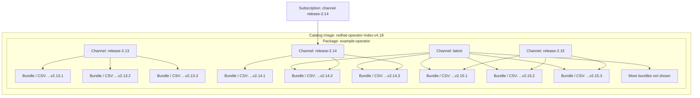
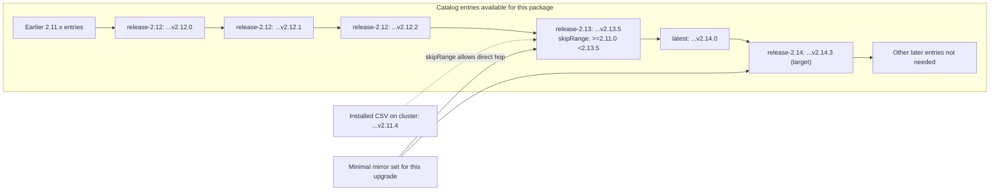
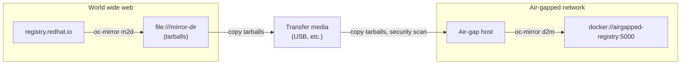
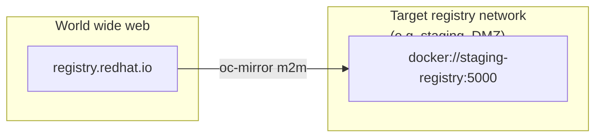

# Surviving OpenShift Air-Gap Mirroring: A Field Guide That Saves You Time, Disk Space, and Sanity

## Abstract

This guide focuses on one specific task: upgrading Red Hat operators in disconnected OpenShift environments while mirroring the smallest practical set of content. **oc-mirror** provides the supported mechanics for copying content from external registries into an internal registry that the cluster can reach, but administrators still need to decide exactly which operator versions, channels, and related artifacts belong in that mirror set.

In a real air-gap, each mirror run can mean pulling gigabytes of content on the connected side, writing tarballs to removable media, clearing security scans, and then replaying the push inside the secure network. That cycle repeats for every operator change. The goal here is to make that workflow smaller, more predictable, and easier to repeat by using a narrow ImageSetConfiguration and the actual OLM upgrade graph.

The official OpenShift documentation and the upstream `oc-mirror` README already cover the supported workflows, command forms, and configuration schema. This guide is meant to sit alongside those references and focus on the decision-making layer around them: choosing the exact supported target version from the support matrix, selecting the right channel for that version, minimizing mirrored content by following the real upgrade graph, and applying the generated artifacts cleanly on the cluster side.

After reading this guide, you will understand:

- How to choose a supported target version and channel for a disconnected operator upgrade
- How to build an ImageSetConfiguration that mirrors only the required operator content
- How to run the mirror workflow reliably and move the resulting content across the air-gap
- What artifacts oc-mirror generates and how to use them to complete the upgrade on the cluster

## Table of Contents

1. Foundations and Terminology
2. Getting Set Up
3. Build the ImageSetConfiguration Carefully
4. Understand `skipRange` Before You Mirror
5. Make Long Mirror Runs Resilient
6. Understand `m2d`, `d2m`, and `m2m`
7. Separate the Cache from the Workspace
8. Apply the Generated Resources Correctly
9. Upgrade an Operator End to End
10. Troubleshooting
11. Quick Reference
12. Caveats
13. References

The examples and flag defaults below were cross-checked against the upstream `oc-mirror` v2 README on March 3, 2026. Confirm the defaults on the exact binary you are running with `oc-mirror --v2 --help`, because flags and generated resources do change across releases.

---

## 1. Foundations and Terminology

Before touching `oc-mirror`, it helps to understand the objects involved. Most disconnected operator-upgrade confusion comes from mixing up four different things: the operator itself, the catalog metadata, the bundle images, and the cluster object that tells OLM where to find the catalog.

### What an Operator Is

An **operator** is application-specific automation packaged for Kubernetes and OpenShift. In practice, it is a controller plus metadata that knows how to install, configure, upgrade, and keep a product healthy over time.

That is different from a **Helm chart**:

- A Helm chart is primarily a packaging and templating format that renders manifests and applies them.
- An operator keeps running after installation and continuously reconciles the product's desired state.
- Some operators may use Helm internally, but "operator" and "Helm chart" are not the same thing.

### What OLM Actually Consumes

When you upgrade an operator through OLM, you are not pointing OLM directly at "a versioned operator image." OLM reads catalog metadata first, then follows that metadata to the relevant bundle images and CSVs.

For a disconnected operator upgrade, it helps to understand two different views of the same data:

- the **hierarchy** of objects in the catalog
- the **selection** of only the entries you actually need for the upgrade path

Start with the hierarchy:



This is the object model:

- One **catalog image** contains metadata for many packages.
- Each **package** exposes one or more channels.
- Each **channel** references one or more versioned bundles.
- The same bundle version can be referenced by more than one channel.
- A **Subscription** selects one channel as the lane OLM should resolve against.

This diagram is intentionally simplified. In the raw FBC JSON/YAML, that "channel references bundles" relationship is represented by `olm.channel` objects whose `entries[]` list bundle names and upgrade edges such as `replaces` and `skipRange`.

In the example above, `...v2.14.2` and `...v2.14.3` are part of both `release-2.14` and `latest`, while `latest` also includes `2.15.x` content. So "the same target version appears in multiple channels" is a real decision point.

Now look at the upgrade-selection view:



This is the upgrade-planning view:

- The catalog may contain many entries across multiple channels.
- The shortest valid path may require only a subset of those entries.
- That subset can cross channel boundaries.
- So the job is not "mirror every bundle in one channel." Mirror the specific entries required to make the target reachable, then choose the supported channel you want OLM to resolve against.

- **Package:** The operator's product name in the catalog, for example `advanced-cluster-management` or `openshift-pipelines-operator-rh`.
- **Channel:** A publisher-defined upgrade track inside that package, such as `release-2.13`, `pipelines-1.20`, `stable-1.37`, `stable`, or `latest`.
- **Bundle image:** The OCI image for one operator version. It carries manifests and metadata for that version.
- **CSV (ClusterServiceVersion):** The installable operator-version object inside the bundle image. When you set `startingCSV` in a `Subscription`, you point to the CSV name (for example `advanced-cluster-management.v2.13.5`), not to a container image tag.
- **Channel head:** The newest bundle entry in one specific channel. If you omit `minVersion` and `maxVersion`, oc-mirror mirrors the channel head only.

Useful mental model: the **bundle image** is the registry artifact, the **CSV** is the installable versioned record inside it, and the **channel** is the path OLM uses to decide which CSVs are available for upgrade.

### How to Read Versions and Channel Names

Operator versions are usually written as `x.y.z`:

- `x` = major version
- `y` = minor version
- `z` = patch version, often called the **z-stream**

So if you move from `2.13.5` to `2.13.7`, that is a z-stream update within the same minor line.

A **channel is not the same thing as a y-stream**. Some channels are effectively tied to one minor line (for example, `release-2.13` usually means the `2.13.x` line). Others, especially channels literally named `stable` or `latest`, are moving labels chosen by the publisher and may point to different minor lines over time.

Channel names are not standardized across operators. They are labels chosen by the operator publisher:

- Version-specific channels can look like `release-2.13`, `pipelines-1.20`, or `stable-1.37`
- Generic channels can look like `stable` or `latest`
- The same operator may expose both version-specific channels and generic channels at the same time

These names are not a universal contract. They usually indicate an upgrade track, but the exact meaning is operator-specific. The safe rule is:

- Treat the channel name as a label, not as a guarantee.
- Check the operator's product support matrix in that product's documentation to see which channels are supported on your OCP minor.
- If the upgrade path matters, inspect the catalog directly. This guide shows two ways later in Section 4: `oc mirror list operators --v1` for a quick view, and `opm render` when you need to inspect the actual `olm.channel.entries[]` data.

Two common misconceptions:

- **`latest` is not a superset of every other channel.** If a package exposes a channel literally named `latest`, that `latest` channel is still just one track. It has its own head and its own upgrade edges.
- **A channel does not automatically contain all historical versions from all other channels.** The upgrade graph is defined per channel. Some bundle versions may appear in multiple channels, but channels are still separate tracks.

For disconnected planning, the safest mental model is: **treat the channel as a support boundary, not just as a path that happens to contain the target version**. If the same target version appears in `latest`, `stable`, and `release-2.14`, the best default is usually the most specific supported versioned channel (`release-2.14`), because that is less likely to surface a newer unsupported minor for your current OCP version later.

### What a Catalog Is

A **catalog** is metadata that tells OLM which operator packages exist, which channels each package exposes, which bundle images back those channels, and what upgrade edges connect the versions.

In modern OpenShift, that catalog is usually stored as a **file-based catalog (FBC)** inside an OCI image. People use several names for this:

- catalog
- catalog image
- index image

They are usually talking about the same thing: an image that contains catalog metadata.

Under the hood, in an FBC, this metadata is just structured JSON/YAML stored in the image. When you run `opm render`, you are effectively dumping that metadata so you can inspect it directly.

That catalog metadata is made of entries such as:

- package definitions
- channel definitions
- bundle references
- upgrade edges (`replaces`, `skipRange`, and related metadata)

The catalog image is not the operator bundle itself. It is the directory of metadata that points to the bundle images OLM can install.

### CatalogSource, ClusterCatalog, and Why They Exist

The cluster still needs a Kubernetes/OpenShift object that tells OLM where your catalog image lives.

- **CatalogSource:** The traditional OLM object that points to a catalog image and makes it available to OperatorHub.
- **ClusterCatalog:** A newer form used on newer clusters/builds for the same broad purpose: exposing catalog content to OLM from a specific image.

Both are pointers to catalog metadata. They are not the operator payloads themselves.

### Why There Are Multiple Catalog Families

You will commonly see several catalog families:

- **Red Hat Operators:** Red Hat-published content.
- **Certified Operators:** Partner content that has gone through Red Hat certification.
- **Community Operators:** Community-maintained content with a different support model.
- **Red Hat Marketplace:** A separate catalog family you may still see in some environments and older examples.

You can mirror from any of these, and you can also create your own filtered internal catalog that contains only the packages you actually mirrored.

### Why Each OCP 4.x Version Has Its Own Catalog Image

The catalog image tag is usually tied to the OCP minor version because it is a compatibility snapshot for that OpenShift release. The package set, default channels, and supported upgrade paths can differ between `v4.16`, `v4.17`, and `v4.18`.

So `redhat-operator-index:v4.16` and `redhat-operator-index:v4.18` are not interchangeable, even though the same operator may exist in both. Use the catalog image that matches the OCP minor you are targeting.

### Workflow Shorthand (Now That the Model Makes Sense)

Once the objects are clear, the workflow shorthand is straightforward:

- **m2d (mirror-to-disk):** You are connected to the internet. You pull images from Red Hat's registry and write them as tarballs to a local directory. This is the "fill the USB drive" step.
- **d2m (disk-to-mirror):** You are on the air-gapped side. You read those tarballs and push the images into your on-premises registry. This is the "unpack the USB drive" step.
- **m2m (mirror-to-mirror):** You have a bastion host that can reach both the internet and your internal registry simultaneously. Skip the tarballs entirely and copy directly.

See Section 6 for details and diagrams.

---

## 2. Getting Set Up

### Download the Binary

Get oc-mirror from the [Red Hat Hybrid Cloud Console](https://console.redhat.com/openshift/downloads) → OpenShift disconnected installation tools → OpenShift Client (oc) mirror plugin → Select OS Type and architecture → Download

The binary is not tied 1:1 to a single OCP minor release the way the catalog index image tag is. The tighter coupling to a specific OCP release is in your **ImageSetConfiguration** (the index image tag you reference, e.g. `redhat-operator-index:v4.18`) — more on that in Section 3. Still, use the build your OpenShift toolchain policy expects, and verify behavior on that build with `oc-mirror --v2 --help`.

You will see both **`oc-mirror`** and **`oc mirror`** in docs and examples. They are the **same binary**; the difference is how you invoke it and where the binary must live.

- **Standalone:** The downloaded executable is named `oc-mirror`. You can run it by path without putting it on `PATH` — for example `./oc-mirror` from the directory where it lives. No `oc` CLI is required. Handy on a jump host that only needs mirroring.
- **Plugin:** The OpenShift CLI (`oc`) looks for executables named `oc-<subcommand>` on your `PATH`. If the binary is on `PATH` as `oc-mirror`, then `oc mirror` runs that binary — **`oc` literally invokes the `oc-mirror` executable** behind the scenes. The added value is convenience: one command (`oc`) for both cluster operations and mirroring, and consistency with other `oc` subcommands (e.g. `oc adm`, `oc mirror`).

### Use v2 for Mirroring Workflows

oc-mirror v1 is deprecated as of OCP 4.18 and will eventually be removed. Use `--v2` and `apiVersion: mirror.openshift.io/v2alpha1` for everything. The main reason you might still use v1 is the `oc mirror list operators` subcommand (catalogs, packages, channels), which was never ported to v2 — more on that in the skipRange section. For all mirroring workflows (m2d, d2m, m2m), use v2.

### Authentication

What it **does** need is a valid auth file so it can authenticate against `registry.redhat.io`.

The upstream v2 README documents these default locations:

```
$XDG_RUNTIME_DIR/containers/auth.json
~/.docker/config.json
```

If your host stores credentials somewhere else (for example `~/.config/containers/auth.json`, which is common on Podman-based systems), pass `--authfile` explicitly so there is no ambiguity.

The easiest way to populate one is `podman login registry.redhat.io` if Podman is available (Podman is not a requirement; oc-mirror does not exec Podman or Docker. It is a self-contained Go binary that handles image operations internally using the `containers/image` library.). If Podman is not available, download your [pull secret](https://console.redhat.com/openshift/install/pull-secret) from the Hybrid Cloud Console. The download is already valid JSON with an `auths` key; you can save it as `auth.json` as-is. If you want to validate or merge it with an existing auth file, `jq` is useful (for example `jq . pull-secret` to validate), but it is not required — the raw file is fine.

Another option is to use `--authfile` with the pull-secret:

```bash
oc-mirror --authfile /etc/mirror/pull-secret -c config.yaml file:///mirror-dir --v2
```

---

## 3. Build the ImageSetConfiguration Carefully

Here is where most people leave time and disk space on the table.

The ImageSetConfiguration is the single file that tells oc-mirror what to mirror. Get this right and every subsequent run is fast, surgical, and predictable. Get it wrong and you spend Tuesday afternoon watching 20 GB of operator images transfer to a USB drive for a one-version patch.

### Minimal Structure

```yaml
kind: ImageSetConfiguration
apiVersion: mirror.openshift.io/v2alpha1
mirror:
  platform:
    channels:
      - name: stable-4.18
        minVersion: 4.18.1
        maxVersion: 4.18.1
    graph: true
  operators:
    - catalog: registry.redhat.io/redhat/redhat-operator-index:v4.18
      packages:
        - name: compliance-operator
          channels:
            - name: stable
              minVersion: 1.7.0
  additionalImages:
    - name: quay.io/example/my-app:latest
```

### Read the `operators` Stanza From Left to Right

For a new reader, this part of the YAML is easier if you read it as a chain of narrowing choices:

- `**catalog**`: Which metadata source are you reading from?
- `**packages[].name**`: Which operator inside that catalog do you want?
- `**channels[].name**`: Which upgrade track for that operator do you want?
- `**minVersion` / `maxVersion**`: Which versions inside that channel do you want?

If you skip one of those choices, oc-mirror still makes a choice for you. That can be convenient, but it is also where many accidental oversized mirrors begin.

### Channel Names Are Labels, Not Global Rules

Channel names look inconsistent because they are inconsistent; there is no universal naming convention. (See also "How to Read Versions and Channel Names" in Section 1.)


| Example channel name | Usually means                                      | What you should assume                                                            |
| -------------------- | -------------------------------------------------- | --------------------------------------------------------------------------------- |
| `release-2.13`       | A track aligned to a specific product minor line   | Good candidate when you want to stay on that minor line, but still verify support |
| `pipelines-1.20`     | Same idea, different product-specific naming       | Product-specific, not special to OLM                                              |
| `stable-1.37`        | A "stable" track anchored to a specific minor line | Stable within that operator's definition, not globally                            |
| `stable`             | A generic stable track                             | Could move over time; inspect the channel head                                    |
| `latest`             | A publisher-defined fast-moving track              | Not a superset of all other channels                                              |


What matters is not the word in the channel name. What matters is the set of bundle entries and upgrade edges inside that channel.

That leads to three practical rules:

- A **channel head** is just the newest entry in one specific channel.
- The `latest` channel does **not** automatically contain every historical version from every other channel.
- Two channels may share some bundle versions, but they are still separate tracks with separate defaults and upgrade behavior.

### How to Choose the Channel When the Same Version Appears in Multiple Channels

This is the decision that matters most in a disconnected environment.

There are really two separate questions:

1. **What do I need mirrored so OLM can reach the target version?**
2. **Which channel do I want the cluster to keep tracking after it reaches that version?**

The path solver script and `skipRange` answer **question 1**. The `channels[].name` you put in `ImageSetConfiguration` (and later in the `Subscription`) answers **question 2**.

That means if a target version appears in multiple channels, you should usually choose the channel you want the cluster to remain on afterward, not just any channel that happens to contain that version.

Practical rule:

- Mirror whatever channel segments the path solver says are required to make the upgrade reachable.
- Set the final channel to the supported destination track you actually want to follow.
- In most cases, prefer the most specific supported versioned channel (`release-2.14`, `pipelines-1.20`, `stable-1.37`) over a rolling label like `latest`.
- Use `latest` or a generic `stable` only if the vendor's support matrix explicitly tells you that is the supported track for your OCP version.

Example:

- If `2.14.x` appears in `latest`, `stable`, and `release-2.14`
- and your current OCP version supports ACM `2.14`
- and you want to stay on the `2.14.x` line

then the safer default is `**release-2.14`**.

Why? Because `latest` may later move to `2.15.x` (or another newer minor) while your current OCP version may not support that newer operator minor yet.

### Why `additionalImages` Exists

The `operators` section is for OLM-managed content. The `additionalImages` section is for ordinary OCI images that you also need in a disconnected environment but that are **not** operator bundles.

Typical reasons to use `additionalImages`:

- Your application pulls a base image from an external registry
- A sidecar or utility image must be available internally
- You want to preload a non-operator image during the same mirror run

oc-mirror treats `additionalImages` as plain image copies. There are no channels, CSVs, or OLM upgrade rules involved.

### The Key Levers

`**minVersion` / `maxVersion`:** Mirror only bundles in a version range. If you omit `maxVersion`, oc-mirror will pick up new z-stream releases automatically on future runs — useful for keeping the config unchanged while staying current.

**No `maxVersion` = floating cap:**

```yaml
channels:
  - name: release-2.13
    minVersion: 2.13.5
    # No maxVersion — next week's 2.13.7 will be included automatically
```

**Channel head only:** Omit both `minVersion` and `maxVersion` entirely to mirror just the current channel head. Clean, minimal, zero guessing.

**The gotcha with default channels:** If you specify `minVersion`/`maxVersion` without naming a channel, oc-mirror applies them to the package's **default channel** in the catalog. The default channel is not always the one you want — in fact it is frequently **not supported for your OCP version**. For example, ACM's default channel in the OCP 4.18 catalog may be `release-2.14`, which is not validated for OCP 4.16. Always name the channel explicitly and cross-check with the product support matrix.

---

## 4. Understand `skipRange` Before You Mirror

This section helps you minimize mirrored content: use `skipRange` and the upgrade graph to mirror only the bundles required for the path, then choose the supported channel for the cluster.

### The Problem

You have ACM 2.11.4 installed on a cluster. You need to get to 2.13.5. The naive approach: put both versions (and every version in between) in your ImageSetConfiguration, run m2d, pack up the tarballs, and watch your laptop write 12 GB to an external drive.

The smart approach: understand `skipRange` and mirror only the bundles that are actually necessary for OLM to resolve the upgrade.

### How skipRange Works

`skipRange` is upgrade metadata attached to a bundle's catalog entry. In `opm render` output, the most useful place to inspect it is usually the `olm.channel` entry for that bundle. It defines a semver range from which this bundle can be installed in a single OLM hop, without requiring every intermediate bundle to be present in the catalog:

```json
"skipRange": ">=2.11.0 <2.13.5"
```

With this annotation, the 2.13.5 bundle can upgrade **any** installed version in `[2.11.0, 2.13.5)` directly. OLM uses the **currently installed CSV on the cluster** as the "from" version — the old bundle does not need to exist in the new catalog at all. You only need to mirror 2.13.5 (and 2.13.4, 2.13.3, etc. are all irrelevant to the upgrade).

The result: instead of mirroring every bundle along a 2.11.4 → 2.12.x → 2.13.5 path, you may only need to mirror 2.13.5.

If the CSV vs. bundle distinction feels fuzzy, use this mental model: the **bundle image** is the shipped artifact in the registry, and the **CSV** is one of the manifests inside it that OLM reasons about (see Section 1). When people say "mirror bundle 2.13.5" and "upgrade to CSV `...v2.13.5`," they are usually talking about the same operator version viewed from two different layers.

### Finding the skipRange

Operator catalogs are **file-based catalogs (FBC)** — JSON and YAML files inside a container image that describe every operator, channel, and upgrade edge. You work with them indirectly via `opm`. Render one to JSON with:

```bash
opm render registry.redhat.io/redhat/redhat-operator-index:v4.18 > catalog.json
```

`opm render` writes a JSON stream (one JSON object per line), not a single JSON array. That matters for `jq`: query the stream directly, or use `jq -s` first if you want to convert it into an array.

For upgrade-path work, the most useful objects are:

- Objects with `"schema": "olm.channel"`: these carry `entries[]` with `name`, `replaces`, and `skipRange` for each bundle in that channel
- Objects with `"schema": "olm.bundle"`: these carry bundle metadata, but you usually do not need them to compute the shortest upgrade path

Search it:

```bash
# Find the channel entry (and skipRange) for a specific bundle
jq -r \
  --arg pkg "advanced-cluster-management" \
  --arg bundle "advanced-cluster-management.v2.13.5" '
  select(.schema == "olm.channel" and .package == $pkg) |
  .name as $channel |
  .entries[] |
  select(.name == $bundle) |
  {channel: $channel, name, replaces, skipRange}
' catalog.json
```

### The Path Solver Script

If you have the `resolve-operator-path.sh` script included in this guide package, it automates this analysis. Feed it the raw `opm render` output and it walks the `olm.channel.entries[]` graph to find the shortest valid hop sequence from your installed version to the target:

It uses Bash associative arrays, so run it with Bash 4+ (on older macOS shells, install a newer Bash first).

```bash
opm render registry.redhat.io/redhat/redhat-operator-index:v4.18 > catalog.json
./resolve-operator-path.sh \
  advanced-cluster-management \
  2.11.4 \
  2.13.5 \
  catalog.json \
  registry.redhat.io/redhat/redhat-operator-index:v4.18
```

The script prints the shortest valid hop path and then emits an ImageSetConfiguration snippet. It intentionally uses `minVersion` only for each required channel segment (a floating head), so future z-streams in those channels remain in scope. If you want an exact pin, add `maxVersion` yourself after reviewing the output.

### The v1 Shortcut for Exploring Channels

If you want to quickly explore what channels and versions exist for a given operator without rendering the full catalog, the v1 subcommand still works (just remember it's deprecated and targets v1 semantics):

```bash
# What channels exist?
oc mirror list operators --catalog=registry.redhat.io/redhat/redhat-operator-index:v4.18 \
  --package=advanced-cluster-management --v1

# What versions are in a channel?
oc mirror list operators --catalog=registry.redhat.io/redhat/redhat-operator-index:v4.18 \
  --package=advanced-cluster-management --channel release-2.13 --v1
```

Use this for exploration, then switch to `opm render` + the path solver for the actual ImageSetConfiguration.

### OCP OUIC: Useful, But Trust the Support Matrix First

The [OCP Operator Upgrade Information tool](https://access.redhat.com/labs/ocpouic/) at `access.redhat.com/labs/ocpouic/` is handy for visualising operator upgrade paths. Use it as a starting point. But do not trust the default channel it shows — it reflects the catalog default, which is not always the supported channel for your OCP version. Always validate against the product support matrix before pinning a channel in production.

---

## 5. Make Long Mirror Runs Resilient

A full operator catalog mirror can run for a long time. On a slow or intermittent connection, it will fail. These two flags are your insurance policy.

### `--retry-times`

Tells oc-mirror how many times to retry a failed image pull before giving up:

```bash
oc-mirror -c config.yaml file:///mirror-dir --v2 --retry-times 5
```

The current v2 README shows a default of `2`. On any production engagement with an internet connection you do not fully control, setting it to `5` is a reasonable starting point. The tradeoff is only extra wait time on repeated failures.

### `--image-timeout`

Sets the per-image timeout as a Go-style duration (`10m`, `30m`, `1h`). The current v2 README defaults it to `10m0s`, which can be too short for large images (some operator bundles are substantial) on a slow link:

```bash
oc-mirror -c config.yaml file:///mirror-dir --v2 --retry-times 5 --image-timeout 1h
```

`1h` is generous, but appropriate if you are pulling through a throttled corporate proxy. Set it based on your worst-case image size and link speed.

### A Realistic Production Command

Combining everything for a reliable long-running mirror:

```bash
oc-mirror \
  -c imagesetconfig.yaml \
  file:///mnt/usb/mirror-dir \
  --v2 \
  --retry-times 5 \
  --image-timeout 1h \
  --authfile /etc/mirror/auth.json
```

---

## 6. Understand `m2d`, `d2m`, and `m2m`

Two different scenarios:

**Air-gap path (m2d → transfer → d2m):** You run m2d on a connected host, then physically move the tarballs across the boundary (e.g. USB), often through a mandatory security scan, then run d2m on a host inside the air-gapped network. The target registry is inside the secure network.

**m2m path:** A bastion host can reach both the internet and a registry (e.g. a staging or DMZ registry). No tarballs and no transfer media — oc-mirror copies directly from Red Hat to that registry. The target is typically a different registry than the one used in the air-gap path (e.g. staging vs. production air-gapped registry).







*Top: air-gap path — two networks (World wide web and Air-gapped). oc-mirror m2d writes tarballs; you copy them via transfer media and through security scan; oc-mirror d2m runs inside the air-gap and pushes to the registry. Bottom: m2m path — oc-mirror copies directly from Red Hat to a target registry in another network (e.g. staging or DMZ), no tarballs.*

### m2d (connected side)

```bash
oc-mirror -c imagesetconfig.yaml file:///path/to/mirror-dir --v2 --retry-times 5
```

Output in `mirror-dir/`:

- **Tarballs:** `mirror_seq1_000000.tar` (and additional sequence files for large runs)
- **working-dir/:** metadata, mapping files, sequence state, and cluster-resources

### What to Transfer

**Only the tarballs.** Leave `working-dir/` behind. It is regenerated from the tarballs when you run d2m on the other side. Transferring it wastes space and is unnecessary.


| What              | Transfer? |
| ----------------- | --------- |
| `mirror_seq*.tar` | **Yes**   |
| `working-dir/`    | **No**    |


### d2m (air-gapped side)

Copy the tarballs across (USB, secure transfer, whatever your process requires), then:

```bash
oc-mirror \
  -c imagesetconfig.yaml \
  --from file:///path/to/mirror-dir \
  docker://airgapped-registry:5000 \
  --v2 \
  --retry-times 3
```

oc-mirror reads the tarballs, regenerates `working-dir/`, and pushes everything to your registry.

### m2m (when you have a bastion)

If a bastion host can reach both `registry.redhat.io` and a target registry (e.g. staging or DMZ — often a *different* registry from the one used in the air-gap d2m step), you can skip tarballs and transfer entirely. oc-mirror copies directly from Red Hat to that registry:

```bash
oc-mirror \
  -c imagesetconfig.yaml \
  --workspace file:///path/to/workspace \
  docker://staging-registry.example.com:5000 \
  --v2 \
  --retry-times 5 \
  --image-timeout 1h
```

The workspace is used only for metadata; no tarballs are written. Content then flows from the staging (or DMZ) registry into the air-gapped environment via whatever process you use (e.g. a second, internal mirror or manual promotion).

### Incremental Runs

oc-mirror tracks state. If you run m2d again with the same workspace, it will only mirror what has changed since the last run. Keep the workspace directory between runs. The `--since` flag lets you further restrict this to content newer than a specific date:

```bash
oc-mirror -c config.yaml file:///mirror-dir --v2 --since 2025-06-01
```

Delete the workspace only when you need a complete clean slate.

---

## 7. Separate the Cache from the Workspace

Two different directories. Completely different purposes. Confusing them is a common source of "why is oc-mirror re-downloading everything?"

**The workspace** is the `file://` path you pass on the command line. For **m2d**, that directory holds your tarballs and `working-dir/`. For **m2m**, the same path holds only metadata (no tarballs). Only the tarballs cross the air-gap; `working-dir/` is regenerated from them when you run d2m on the other side.

**The cache** is an internal directory (default location is under `$HOME`; override with `--cache-dir` — run `oc-mirror --v2 --help` to confirm on your build) where oc-mirror stores blob data and metadata for performance. It is separate from the workspace. Do not transfer it to the air-gapped side. Deleting it does not delete your tarballs.

When to delete the cache: only if it is corrupted and causing strange behavior. Deleting it means the next run downloads more from scratch — no other consequences.

---

## 8. Apply the Generated Resources Correctly

This is where a lot of successful mirror runs go wrong downstream. You've mirrored everything, pushed it to the registry, and now the cluster still can't find any operators. The problem is almost always in how the generated cluster-resources were (or weren't) applied.

### What Gets Generated

After a successful d2m or m2m run, check `working-dir/cluster-resources/`:

```bash
ls working-dir/cluster-resources/
# idms.yaml         → ImageDigestMirrorSet
# itms.yaml         → ImageTagMirrorSet
# catalogsource.yaml    (if generated)
# clusterCatalog.yaml   (if generated)
# updateservice.yaml   (if you mirrored the OCP update graph)
```

The current upstream v2 README mentions both `catalogsource.yaml` and `clusterCatalog.yaml`. The exact set depends on the oc-mirror build and the cluster capabilities you are targeting, so use the files actually generated in your `cluster-resources/` directory as the source of truth for that run.

**ImageDigestMirrorSet (IDMS) / ImageTagMirrorSet (ITMS)** tell the cluster's CRI-O to redirect image pulls to your mirror registry. Without these, pods will try to pull from `registry.redhat.io` directly and fail.

**A generated CatalogSource or ClusterCatalog** points OLM at your mirrored catalog index image. Which one you should apply depends on what oc-mirror generated for your run.

**UpdateService** is only generated when you mirror the OCP update graph (`graph: true` in the platform section). It tells the OpenShift Update Service (OSUS) where to find update metadata for disconnected cluster upgrades.

### Apply Order (Critical)

Apply mirror redirects first and wait for the MachineConfigPool rollout to complete before applying the catalog. These redirects require a node configuration update; if you apply the catalog first, the catalog pod may try to pull from `registry.redhat.io` and fail in an air-gap.

```bash
# 1. Apply mirror redirects first
oc apply -f working-dir/cluster-resources/idms.yaml
oc apply -f working-dir/cluster-resources/itms.yaml

# 2. Wait for MachineConfigPool to complete the rollout
oc wait mcp/worker --for condition=Updated --timeout=30m
oc wait mcp/master --for condition=Updated --timeout=30m

# 3. Apply exactly one generated catalog manifest:
# oc apply -f working-dir/cluster-resources/catalogsource.yaml
# oc apply -f working-dir/cluster-resources/clusterCatalog.yaml

# 4. Verify the catalog backend is healthy (CatalogSource example)
oc get catalogsource -n openshift-marketplace
oc get pods -n openshift-marketplace
```

If you are using `clusterCatalog.yaml`, verify that resource instead of querying `CatalogSource`.

### Filtered vs. Full Index (CatalogSource-Based Workflows)

If oc-mirror generated `clusterCatalog.yaml`, start there and treat that generated manifest as authoritative. The retag-and-publish pattern below is for CatalogSource-based workflows.

Depending on your oc-mirror v2 version, the catalog image pushed to your registry may be either:

- **Filtered:** Contains metadata only for the operators you mirrored. OperatorHub shows only those operators. Use the generated CatalogSource directly.
- **Full:** Contains the complete upstream index. OperatorHub shows *all* Red Hat operators. Installing anything you didn't mirror will fail with `ImagePullBackOff`.

Check OperatorHub after applying the CatalogSource. If you see operators you didn't mirror, the index is full. In that case, **do not** replace the default `redhat-operators` CatalogSource with this image — you'll break every operator tile for non-mirrored operators. Instead, create a **new** CatalogSource pointing at a retagged copy of the mirrored index:

```bash
# Retag with a date or version identifier (e.g. v4.18-YYYYMMDD) so you can track it
podman tag \
  airgapped-registry:5000/redhat/redhat-operator-index:v4.18 \
  airgapped-registry:5000/redhat/redhat-operator-index:v4.18-20260304

# Create a new CatalogSource (do not touch the existing redhat-operators one)
cat <<EOF | oc apply -f -
apiVersion: operators.coreos.com/v1alpha1
kind: CatalogSource
metadata:
  name: redhat-operators-mirrored
  namespace: openshift-marketplace
spec:
  sourceType: grpc
  image: airgapped-registry:5000/redhat/redhat-operator-index:v4.18-20260304
  displayName: Red Hat Operators (Mirrored)
  publisher: Red Hat
EOF
```

---

## 9. Upgrade an Operator End to End

Here is the full end-to-end workflow for upgrading an operator in a sparse, air-gapped mirror setup. The scenario: ACM 2.11.4 is installed, target is 2.13.5, cluster is OCP 4.16.

**Step 1: Determine the minimal mirror set**

```bash
opm render registry.redhat.io/redhat/redhat-operator-index:v4.16 > catalog.json
./resolve-operator-path.sh \
  advanced-cluster-management \
  2.11.4 \
  2.13.5 \
  catalog.json \
  registry.redhat.io/redhat/redhat-operator-index:v4.16
```

The script prints the shortest valid hop path, the channel segments it traverses, and the minimum version to include for each required channel segment. That tells you whether `skipRange` covers the whole jump or whether you need an intermediate bundle in another channel.

**Step 2: Configure the ImageSetConfiguration**

```yaml
kind: ImageSetConfiguration
apiVersion: mirror.openshift.io/v2alpha1
mirror:
  operators:
    - catalog: registry.redhat.io/redhat/redhat-operator-index:v4.16
      packages:
        - name: advanced-cluster-management
          channels:
            - name: release-2.13   # Per support matrix for OCP 4.16 — NOT the catalog default
              minVersion: 2.13.5
              # No maxVersion — picks up future z-streams automatically
```

In this example, `release-2.13` is chosen not just because it contains `2.13.5`, but because it is the supported track we want the cluster to follow on OCP 4.16 after the upgrade. Even if `2.13.5` also appeared in a broader channel like `latest`, the versioned channel is the safer default in a disconnected environment.

**Step 3: Run m2d with retries**

```bash
oc-mirror -c imagesetconfig.yaml file:///mnt/usb/mirror-dir --v2 \
  --retry-times 5 --image-timeout 1h
```

**Step 4: Transfer tarballs only**

Copy `mirror_seq*.tar` files to the air-gapped side. Leave `working-dir/` behind.

**Step 5: Run d2m**

```bash
oc-mirror -c imagesetconfig.yaml \
  --from file:///mnt/usb/mirror-dir \
  docker://airgapped-registry:5000 \
  --v2 --retry-times 3
```

**Step 6: Apply cluster resources in order**

```bash
oc apply -f working-dir/cluster-resources/idms.yaml
oc apply -f working-dir/cluster-resources/itms.yaml
oc wait mcp/worker --for condition=Updated --timeout=30m
oc wait mcp/master --for condition=Updated --timeout=30m
```

**Step 7: Apply the generated catalog resource**

Apply the generated catalog manifest from `working-dir/cluster-resources/`. If oc-mirror generated `clusterCatalog.yaml`, use that. If it generated `catalogsource.yaml` and the index is **full** (OperatorHub shows operators you did not mirror), do not replace the default `redhat-operators` CatalogSource — create a new CatalogSource with a retagged image as in Section 8 (Filtered vs. Full Index). If the index is filtered, apply the generated `catalogsource.yaml` directly.

**Step 8: Update the Subscription**

```yaml
apiVersion: operators.coreos.com/v1alpha1
kind: Subscription
metadata:
  name: advanced-cluster-management
  namespace: open-cluster-management
spec:
  channel: release-2.13
  source: redhat-operators-mirrored     # Point at the new CatalogSource
  sourceNamespace: openshift-marketplace
  installPlanApproval: Manual           # Review before it upgrades
  startingCSV: advanced-cluster-management.v2.13.5   # CSV name, not an image tag
```

Keep the same logic here: the `Subscription.spec.channel` should describe the supported lane you want to keep tracking after the upgrade, not merely any channel that happened to contain the target CSV on the day you mirrored it.

**Step 9: Approve the InstallPlan**

```bash
# Find the pending InstallPlan
oc get installplan -n open-cluster-management

# Approve it
oc patch installplan <name> -n open-cluster-management \
  --type merge --patch '{"spec":{"approved":true}}'
```

OLM resolves the upgrade path. If the 2.13.5 bundle's `skipRange` covers 2.11.4, it upgrades in one step. If an intermediate bundle (e.g. 2.12.x) is required, OLM installs it first — which is why the path solver script is worth running upfront to make sure you actually mirrored that intermediate bundle. The path answers "can I get there?"; the channel answers "what supported track do I stay on afterward?"

---

## 10. Troubleshooting


| Symptom                                                          | Likely cause                                                                                   | What to check                                                                                                                 | Fix                                                                                                                 |
| ---------------------------------------------------------------- | ---------------------------------------------------------------------------------------------- | ----------------------------------------------------------------------------------------------------------------------------- | ------------------------------------------------------------------------------------------------------------------- |
| `oc-mirror` keeps failing mid-run on a slow link                 | Retry and timeout settings are too low for the connection                                      | Your command line, proxy path, and whether failures happen on large images                                                    | Raise `--retry-times` and use a longer `--image-timeout` such as `1h`                                               |
| `d2m` cannot find content to publish                             | Wrong `--from` path or the tarballs were not copied intact                                     | The directory contains `mirror_seq*.tar` and matches the path passed to `--from`                                              | Re-copy the tarballs and point `--from` at the directory that contains them                                         |
| OperatorHub stays empty after a successful push                  | The generated catalog manifest was never applied, or the catalog pod cannot start              | `working-dir/cluster-resources/`, `oc get catalogsource -n openshift-marketplace`, and `oc get pods -n openshift-marketplace` | Apply the generated `catalogsource.yaml` or `clusterCatalog.yaml`, then inspect the catalog pod logs                |
| Catalog pod shows `ImagePullBackOff` in a disconnected cluster   | IDMS or ITMS was not applied first, or the MachineConfig rollout is still in progress          | `oc get mcp`, `oc get catalogsource -n openshift-marketplace`, and the catalog pod events                                     | Apply IDMS and ITMS first, wait for MCP rollout, then re-apply the catalog (Section 8).                               |
| The operator tile exists, but install fails on an unmapped image | You mirrored a full catalog image but not all of the packages it advertises                    | Whether OperatorHub shows operators you did not intentionally mirror                                                          | Publish a separate CatalogSource for the mirrored subset, or mirror the missing content intentionally               |
| OLM does not offer the upgrade version you expected              | Wrong channel, unsupported channel for your OCP version, or the target bundle was not mirrored | The `Subscription`, the support matrix, and the catalog entry for the target bundle                                           | Correct the channel, verify support for your OCP version, and confirm the target version is in the mirrored catalog |


---

## 11. Quick Reference


| Flag                | What it does                              | When to use                                               |
| ------------------- | ----------------------------------------- | --------------------------------------------------------- |
| `--v2`              | Selects v2 behavior                       | Always                                                    |
| `--retry-times N`   | Retries failed image pulls N times        | Any production mirror run; set to at least 3              |
| `--image-timeout D` | Per-image timeout duration (`10m`, `1h`)  | Slow links or large images; try `1h` on constrained links |
| `--authfile`        | Auth file path override                   | Non-default credential location                           |
| `--from`            | Source directory for d2m                  | Air-gapped side: point at directory with tarballs         |
| `--workspace`       | Metadata workspace for m2m                | Bastion/m2m workflows                                     |
| `--since`           | Incremental: only content newer than date | Subsequent runs on same workspace                         |
| `--cache-dir`       | Override cache location (default under $HOME) | Shared systems or custom disk layouts                 |


---

## 12. Caveats

`**skipDependencies` is not something to trust blindly.** The field exists in the ImageSetConfiguration API, but it is not a safe substitute for testing your exact release combination. If dependency trimming matters, validate the result in pre-production instead of assuming that flag will exclude everything you expect.

**The catalog default channel may not be the supported one for your OCP version.** Every operator has a "default channel" in the catalog; for many operators it targets a newer OCP version than yours. Always pin the Subscription's channel to what the product support matrix specifies (see also Section 3, "The gotcha with default channels").

**Apply IDMS/ITMS first and wait for MCP rollout before applying the catalog.** The redirects trigger a MachineConfig update and rolling node restart (30+ minutes on large clusters). See Section 8 for the correct apply order.

**v1 is going away.** The `oc mirror list operators` subcommand is convenient for exploration but only works with `--v1`, which is deprecated. Build your workflow around `opm render` now.

---

## 13. References

- [oc-mirror README (v2)](https://github.com/openshift/oc-mirror/blob/main/README.md)
- [oc-mirror README (v1)](https://github.com/openshift/oc-mirror/blob/main/v1/README_v1.md)
- [oc-mirror on GitHub](https://github.com/openshift/oc-mirror)
- [OCP Disconnected installation mirroring](https://docs.openshift.com/container-platform/latest/installing/disconnected_install/installing-mirroring-disconnected.html)
- [Getting operators to use with oc-mirror (Red Hat Learning)](https://developers.redhat.com/learning/learn:openshift:master-operator-mirroring-oc-mirror/resource/resources:getting-operators-use-oc-mirror)
- [OCP Operator Upgrade Information (OUIC)](https://access.redhat.com/labs/ocpouic/)
- [Red Hat solution 7061405 — EUS shortest path and oc-mirror](https://access.redhat.com/solutions/7061405)
- [File-based catalogs (OLM)](https://olm.operatorframework.io/docs/reference/file-based-catalogs/)
