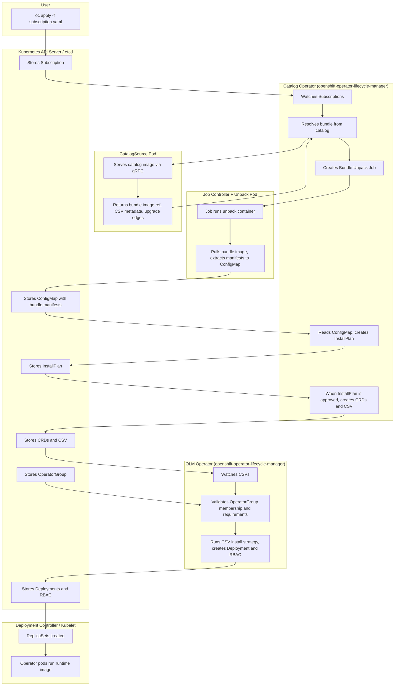

# OpenShift OLM Field Guide for Disconnected Environments

**Last updated:** 2025-03-11 · **Document version:** 1.1

This guide is for Red Hat consultants and customer platform teams who need to mirror and upgrade OLM-based operators in disconnected or air-gapped OpenShift environments. It focuses on the part that usually causes real project delays: decision quality. In air-gap programs, every mirror run has cost (time, bandwidth, media handling, security review, and change windows), so the goal is not to mirror everything. The goal is to mirror exactly what your cluster needs, on a supported path, with predictable operational outcomes.

The official OpenShift and `oc-mirror` documentation already defines supported commands, schemas, and workflows. This guide is a companion to those references and focuses on practical execution choices:

- choosing the exact supported target version from the support matrix and checking supportability quickly
- selecting the right channel for that target and OCP version
- minimizing mirrored content by following real upgrade edges (`replaces` and `skipRange`)
- applying generated resources in the right order so the disconnected cluster behaves as expected

**What this guide is not:**

- not a replacement for official product documentation, support policy, or release notes
- not a generic Kubernetes operator tutorial
- not a promise that one workflow fits every security boundary or customer process

**How to use this guide:**

- read **Section 1** once to lock the mental model
- use **Section 2** for `oc-mirror` setup and baseline workflows
- use **Section 3** for minimal-version mirroring (`skipRange` + path solver)
- use **Section 4** for cluster-side install/upgrade actions
- treat examples as templates and always validate channel/version decisions against your product support matrix

**Table of contents**

- [1. Foundations](#1-foundations) — Terminology, OLM flow, mental model
- [2. oc-mirror](#2-oc-mirror) — Setup, workflows (m2d, d2m, m2m), ImageSetConfiguration, troubleshooting
- [3. Mirror only required versions](#3-mirror-only-required-versions-skiprange-and-use-the-path-solver) — skipRange and path solver
- [4. Install/upgrade with a mirrored catalog](#4-installupgrade-an-existing-operator-with-a-mirrored-catalog) — Cluster-side apply order and subscription
- [5. References](#5-references)

---

## 1. Foundations

The terminology, installation flow, and mental model below are the core concepts you need before working with catalogs or disconnected mirroring.

### 1.1 Terminology

Terms are ordered to make the flow easier to follow: each concept is introduced before it is used heavily in later sections.

#### 1.1.1 Operator

An **operator** is application-specific automation for Kubernetes (and OpenShift). In practice it is one or more controllers plus API extensions that provide additional functionality to the cluster.

- **Cluster Operators** — Shipped as part of the OpenShift release payload and managed by the **Cluster Version Operator (CVO)**. During cluster installation and cluster upgrades, CVO deploys them as part of the platform lifecycle. You do not install these through OLM.
- **Optional add-on operators** — Managed by **Operator Lifecycle Manager (OLM)**. Unlike Cluster Operators, these are selected per environment and installed from catalogs based on your package/channel/subscription choices.

This guide primarily targets OLM-based operators, but it also covers the disconnected mirroring workflow around them (`oc-mirror`, catalog publishing, and subscription changes).

#### 1.1.2 Package

A **package** is the top-level product name used to identify an operator offering (for example `advanced-cluster-management`). The next terms explain how that package is represented and delivered.

#### 1.1.3 Bundle (bundle image)

In this guide, **bundle** means **bundle image** unless explicitly stated otherwise.

A bundle image is one installable operator version, shipped as a non-runnable OCI image that carries manifests and metadata. OLM pulls it to read manifests; it does not run the bundle image as a workload.

**Directory layout.** A bundle image has two main directories:

- **`manifests/`** — YAML manifests used for installation. Typically includes:
  - **One ClusterServiceVersion (`CSV`)** describing that operator version and install strategy.
  - **One or more `CRD` manifests** required by that version.
- **`metadata/`** — Catalog annotations used by tooling. In many bundles this is primarily `annotations.yaml`; some build pipelines add related metadata files.

The bundle unpack job extracts bundle manifests into a `ConfigMap`. Later OLM controllers use that unpacked content during `InstallPlan` execution and `CSV` reconciliation (explained in sections 1.1.10 and 1.2).

#### 1.1.4 Channel

A **channel** is an upgrade lane within a package. It is a named sequence of bundle entries and upgrade edges (for example `stable`, `release-2.13`, `latest`).

Version notation is typically `x.y.z`:

- `x` = major stream
- `y` = minor stream
- `z` = patch (z-stream)

Publishers use channels to control release cadence and support lanes (for example conservative vs fast-moving lanes). A package can expose multiple channels, and a bundle version can appear in more than one channel. In disconnected environments this matters even more, because every additional channel or version often means additional content you must mirror, transfer, and validate.

#### 1.1.5 Catalog

A **catalog** is metadata that tells OLM what packages/channels/bundles exist and how upgrades connect (`replaces`, `skipRange`). It does *not* contain operator runtime images.

In FBC data, channel entries reference bundle names, and bundle objects include the backing bundle image reference (typically digest-resolved at mirror/install time). That is the "pointer" from package/channel metadata to actual installable content.

In OpenShift, this metadata is stored in an OCI **catalog image** (also called **index image**), commonly from families such as:

- **Red Hat Operators** — `registry.redhat.io/redhat/redhat-operator-index:v4.<minor>`
- **Certified Operators** — `registry.redhat.io/redhat/certified-operator-index:v4.<minor>`
- **Community Operators** — `registry.redhat.io/redhat/community-operator-index:v4.<minor>`

Some older releases and environments may also include **Red Hat Marketplace** (`redhat-marketplace`).

Catalog images are versioned by OCP minor (for example `redhat-operator-index:v4.18`) and are not interchangeable across OCP minors. Modern index images carry **file-based catalog (FBC)** content, which you can inspect with `opm render`.

At a high level, FBC data is a stream of objects such as:

- `olm.package` (package definitions)
- `olm.channel` (channel entries + upgrade edges)
- `olm.bundle` (bundle metadata + bundle image reference)

`opm` is the catalog utility used to inspect this content. Example:

```bash
opm render registry.redhat.io/redhat/redhat-operator-index:v4.18 > catalog.json
jq -r 'select(.schema=="olm.channel") | .package, .name' catalog.json
```

#### 1.1.6 `CatalogSource` / `ClusterCatalog`

The cluster needs a Kubernetes resource that points OLM to a catalog image:

- **`CatalogSource`** (`operators.coreos.com/v1alpha1`) — OLM Classic catalog source object, widely used across OCP 4.x environments.
- **`ClusterCatalog`** (`olm.operatorframework.io/v1`) — OLM v1/extensions catalog object, documented in newer OCP flows (for example OCP 4.20 docs and oc-mirror v2 generated outputs).

Without one of these pointing to your mirrored catalog image, OLM cannot resolve packages/channels for disconnected installs. After creation in the API/etcd, the catalog backend pod(s) are reconciled and started to serve catalog data to OLM.

#### 1.1.7 `Subscription`

A **`Subscription`** is a Kubernetes resource that expresses: "Install this package from this catalog object on this channel."

Key fields include:

- **Package name** (`name`)
- **Catalog reference** (`source` / `sourceNamespace`)
- **Channel** (`channel`)
- **Approval policy** (`installPlanApproval`: `Automatic` or `Manual`)
- **Optional start point** (`startingCSV`)

Bundle/CSV selection is resolved from channel metadata at runtime: by default OLM resolves to the channel head that satisfies constraints; `startingCSV` can pin the initial target when you need controlled starting behavior.

The Catalog Operator watches `Subscription`s and resolves them to an `InstallPlan`.

#### 1.1.8 `InstallPlan`

An **`InstallPlan`** is a Catalog Operator resource listing what should be installed for a resolved subscription.

- **Approval** — Manual subscriptions require explicit approval (`spec.approved: true`).
- **Execution** — The Catalog Operator executes approved plans and creates resources such as `CRD`s and `CSV`s.
- **History** — InstallPlans remain as an audit/history trail.

#### 1.1.9 `OperatorGroup`

An **`OperatorGroup`** defines operator scope (target namespaces) for a namespace.

- A `CSV` must be an active member of an `OperatorGroup` before install strategy runs.
- It controls where RBAC is projected and how operator watch scope is derived.
- In practice, keep ownership clear and avoid overlapping/conflicting groups in the same namespace.

#### 1.1.10 Operator Lifecycle Manager (OLM)

With the objects above in place, OLM controllers do the orchestration:

- **Catalog Operator** — Watches `CatalogSource`/`ClusterCatalog`, `Subscription`, and `InstallPlan`; resolves bundles and executes approved install plans.
- **OLM Operator** — Watches `CSV`s and runs the CSV install strategy to create/update runtime resources (`Deployment`, RBAC, etc.).

You will typically see `catalog-operator` and `olm-operator` pods in the `openshift-operator-lifecycle-manager` namespace.

---

### 1.2 OLM installation flow (Subscription to running operator)

The following flow describes what happens when you create a `Subscription` and OLM installs an operator. Component names (Catalog Operator vs OLM Operator) match OpenShift's actual controllers.



**Notes:**

- The **Catalog Operator** is responsible for `Subscription` resolution, catalog queries, bundle unpack Job, `InstallPlan` creation, and execution of approved `InstallPlan`s (resource creation such as `CRD`s and `CSV`s).
- The **OLM Operator** reconciles `CSV`s and runs the `CSV` install strategy (creating runtime resources like `Deployment`s and RBAC) after requirements are met.
- A `CSV` must be an active member of an `OperatorGroup` before the OLM Operator runs install strategy.
- The bundle image is used only for *unpacking* (manifests to `ConfigMap`). The **operator's runtime container image** (referenced in the `CSV`'s `Deployment` spec) is what actually runs in the operator pods.

---

### 1.3 Mental model

| Concept                                | One-line mental model                                                                                                     |
| -------------------------------------- | ------------------------------------------------------------------------------------------------------------------------- |
| **Operator**                           | Application automation (controllers + APIs). OLM-based = optional add-on managed by OLM.                                  |
| **Package**                            | One operator product in a catalog (e.g. advanced-cluster-management).                                                     |
| **Bundle image**                       | One installable operator version packaged as a non-runnable OCI image containing manifests and metadata.                  |
| **Channel**                            | Upgrade track inside a package (e.g. stable, release-2.13).                                                               |
| **Catalog image**                      | OCI image holding package/channel/bundle metadata and upgrade edges for a specific OCP minor.                             |
| **`CatalogSource` / `ClusterCatalog`** | Cluster object that tells OLM where to read a catalog image from.                                                         |
| **`Subscription`**                     | "Install this package from this catalog object on this channel."                                                          |
| **`InstallPlan`**                      | Catalog Operator's actionable plan generated from a resolved subscription.                                                |
| **`OperatorGroup`**                    | Namespace scope/tenancy guardrail for operator installation and watch targets.                                            |
| **`CSV`**                              | Installable operator-version record that defines install strategy and required APIs.                                      |
| **OLM**                                | Catalog Operator resolves + executes approved plans; OLM Operator reconciles CSV install strategy into runtime resources. |

---

## 2. oc-mirror

Key terms (Operator, Package, Catalog, ImageSetConfiguration, etc.) are defined in **Section 1**.

oc-mirror is the supported Red Hat tool for copying OpenShift and operator content from external registries (such as `registry.redhat.io`) into your own registry or onto disk. In disconnected or air-gapped environments, clusters cannot pull images from the internet; oc-mirror runs on a connected host (or bastion) to mirror the content you need, so you can then move it across the boundary and serve it from an internal registry.

### 2.1 What oc-mirror does

oc-mirror uses a single declarative **ImageSetConfiguration** file to decide what to copy. It can mirror:

- **Platform (OCP) release images and update graph** — For installing or upgrading the cluster itself in a disconnected way.
- **Operator catalogs** — Catalog images (index images) and the bundle images they reference, so OLM on the disconnected cluster can install and upgrade operators.
- **Additional images** — Arbitrary OCI images that your workloads need and that are not part of OLM.

The tool does not install or configure the cluster; it only copies images and generates manifests (e.g. `ImageDigestMirrorSet`, `ImageTagMirrorSet`, `CatalogSource`, `ClusterCatalog`, and when mirroring platform content, `UpdateService`) that you apply on the cluster so it uses your internal registry.

### 2.2 Workflows: m2d, d2m, m2m

Three workflows cover different connectivity patterns:

| Workflow                   | When to use                                                    | What happens                                                                                                                                                                                     |
| -------------------------- | -------------------------------------------------------------- | ------------------------------------------------------------------------------------------------------------------------------------------------------------------------------------------------ |
| **m2d (mirror-to-disk)**   | You have a connected host.                                     | oc-mirror pulls images from the source (e.g. `registry.redhat.io`) and writes them as tarballs to a local directory. You then move that directory (e.g. via removable media) across the air-gap. |
| **d2m (disk-to-mirror)**   | You are on the air-gapped side with the tarballs.              | oc-mirror reads the tarballs and pushes the images to your internal registry. No internet access required.                                                                                       |
| **m2m (mirror-to-mirror)** | A host can reach both the internet and your internal registry. | oc-mirror copies directly from the source registry to your registry. No tarballs or physical transfer.                                                                                           |

**Destination prefixes:** For **m2d** the destination uses the `file://` prefix (local directory). For **d2m** and **m2m** the destination uses the `docker://` prefix (container registry).

For a full air-gap, you typically run **m2d** on a connected machine, transfer the tarballs, then run **d2m** on a host inside the secure network. If you have a bastion that can see both sides, **m2m** avoids the intermediate disk step.

`m2m` is still mirror-to-mirror. In practice, it can be used for internal-to-internal promotion if the host can reach both source and destination registries and has valid credentials for both. The same reachability, auth, and policy checks still apply.

### 2.3 Set up oc-mirror

#### 2.3.1 Obtain the binary

Download oc-mirror from the [Red Hat Hybrid Cloud Console](https://console.redhat.com/openshift/downloads): **OpenShift disconnected installation tools** → **OpenShift Client (oc) mirror plugin** → choose your OS and architecture → Download.

On **aarch64**, **ppc64le**, and **s390x**, oc-mirror v2 is supported only for OpenShift Container Platform 4.14 and later.

The binary is not tied to a single OCP minor version. The coupling to a specific release is in your **ImageSetConfiguration** (e.g. which catalog image tag you use, such as `redhat-operator-index:v4.18`). Use the build that your OpenShift toolchain policy expects and confirm behavior with:

```bash
oc-mirror --v2 --help
```

#### 2.3.2 Standalone vs plugin

You will see both `oc-mirror` and `oc mirror` in documentation. They use the same binary:

- **Standalone** — The executable is named `oc-mirror`. Run it by path (e.g. `./oc-mirror`). No `oc` CLI is required. Useful on a jump host used only for mirroring.
- **Plugin** — If `oc-mirror` is on your `PATH`, the OpenShift CLI (`oc`) invokes it when you run `oc mirror`. One command for both cluster operations and mirroring.

#### 2.3.3 Use v2

oc-mirror v1 was deprecated in OCP 4.18 and will be removed in a future release. For all mirroring (m2d, d2m, m2m), use **v2**:

- Pass `--v2` on the command line.
- Use `apiVersion: mirror.openshift.io/v2alpha1` in your ImageSetConfiguration.

The only v1-only feature still useful for exploration is `oc mirror list operators` (catalogs, packages, channels); it was not ported to v2. Prefer v2 for any real mirror run.

Quick exploration examples:

```bash
# List available packages in a catalog
oc mirror list operators \
  --catalog=registry.redhat.io/redhat/redhat-operator-index:v4.18 \
  --v1

# List channels for a package
oc mirror list operators \
  --catalog=registry.redhat.io/redhat/redhat-operator-index:v4.18 \
  --package=advanced-cluster-management \
  --v1

# List versions in a specific channel
oc mirror list operators \
  --catalog=registry.redhat.io/redhat/redhat-operator-index:v4.18 \
  --package=advanced-cluster-management \
  --channel=release-2.13 \
  --v1
```

#### 2.3.4 Authentication

oc-mirror must authenticate to `registry.redhat.io` (and optionally other registries). It does **not** require Podman or Docker at runtime; it is a self-contained binary that uses the `containers/image` library. It does require a valid **auth file** in a format that library understands.

**Default auth file locations** (see upstream v2 README; your binary may differ, confirm with `--help`):

- `$XDG_RUNTIME_DIR/containers/auth.json`
- `~/.docker/config.json`

If your system uses another path (e.g. `~/.config/containers/auth.json` on some Podman setups), pass `--authfile` explicitly so oc-mirror finds the file.

**How to populate the auth file:**

1. **If Podman is available:** Run `podman login registry.redhat.io`. This writes credentials to a path oc-mirror can use (or that you can point to with `--authfile`).
2. **If not:** Download your [pull secret](https://console.redhat.com/openshift/install/pull-secret) from the Red Hat Hybrid Cloud Console. The file is valid JSON with an `auths` key; save it as `auth.json` (or another path and pass `--authfile`).

Example with an explicit auth file:

```bash
oc-mirror --authfile /etc/mirror/pull-secret -c config.yaml file:///mirror-dir --v2
```

### 2.4 What you need before mirroring

Before you run oc-mirror you need:

1. **ImageSetConfiguration** — A YAML file (e.g. `config.yaml`) that specifies what to mirror: platform channels, operator catalogs and packages/channels/versions, and any additional images. See section 2.7 for how to define it.
2. **Destination** — For **m2d**: a local directory path with the `file://` prefix (e.g. `file:///mnt/usb/mirror-dir`). For **d2m** or **m2m**: a registry URL with the `docker://` prefix (e.g. `docker://registry.example.com:5000`).
3. **Credentials** — Auth file for the source registry (and for d2m/m2m, access to the destination registry as needed).

After a successful run, oc-mirror writes tarballs (m2d) and/or pushes images (d2m, m2m) and generates cluster resources (mirror sets, `CatalogSource` or `ClusterCatalog`, etc.) that you apply on the cluster so it uses the mirrored content.

### 2.5 Resilient run flags

Long mirror runs can fail on slow or flaky links. Two flags improve reliability:

- **`--retry-times N`** — How many times to retry a failed image pull before giving up. The v2 README default is `2`; for production or unreliable networks, use at least `5`. The only cost is extra wait time on repeated failures.
- **`--image-timeout D`** — Per-image timeout as a Go duration (`10m`, `30m`, `1h`). Default is `10m0s`, which can be too short for large operator bundles on a slow link. Use `1h` when pulling through a throttled or unstable connection.

Example production-style m2d command:

```bash
oc-mirror \
  -c imagesetconfig.yaml \
  file:///mnt/usb/mirror-dir \
  --v2 \
  --retry-times 5 \
  --image-timeout 1h \
  --authfile /etc/mirror/auth.json
```

### 2.6 Workspace vs cache

Do not confuse these two directories:

- **Workspace** — The `file://` path you pass on the command line. For **m2d** it holds tarballs and `working-dir/`. For **m2m** it holds only metadata (no tarballs). Only the tarballs cross the air-gap; `working-dir/` is recreated from the tarballs when you run d2m on the other side.
- **Cache** — An internal directory (default under `$HOME`; override with `--cache-dir`; confirm with `oc-mirror --v2 --help`) where oc-mirror stores blobs and metadata for performance. It is separate from the workspace. Do not transfer the cache across the air-gap. Deleting it does not delete your tarballs; the next run will re-download more. If local disk is full, clearing cache is a valid recovery action to free space and allow the next run.

### 2.7 ImageSetConfiguration

The ImageSetConfiguration is the single YAML file that tells oc-mirror what to mirror. It can also include **Helm** repositories and local charts (see the [oc-mirror README](https://github.com/openshift/oc-mirror/blob/main/README.md) for the schema). Correct configuration keeps runs small and predictable.

**Minimal structure:**

```yaml
kind: ImageSetConfiguration
apiVersion: mirror.openshift.io/v2alpha1
mirror:
  platform:
    channels:
      - name: stable-4.18
        minVersion: 4.18.1
        maxVersion: 4.18.1
    graph: true
  operators:
    - catalog: registry.redhat.io/redhat/redhat-operator-index:v4.18
      packages:
        - name: compliance-operator
          channels:
            - name: stable
              minVersion: 1.7.0
  additionalImages:
    - name: quay.io/example/my-app:latest
```

**Operators stanza (read left to right):** `catalog` → which index; `packages[].name` → which operator; `channels[].name` → which channel; `minVersion` / `maxVersion` → which versions. If you omit a level, oc-mirror chooses for you, which often leads to oversized mirrors.

**Channel names** are publisher-defined labels (e.g. `release-2.13`, `stable`, `latest`). There is no global convention. Prefer the channel that matches your OCP support matrix; avoid relying on `latest` unless the vendor documents it for your version.

**minVersion / maxVersion:** In current v2 behavior, omitting `maxVersion` keeps the lower bound while allowing newer z-stream content in later runs. Omitting both typically mirrors channel head behavior for the selected scope. Validate on your exact binary with `oc-mirror --v2 --help`. If you set version bounds but do not name a channel, oc-mirror can use the package **default channel**, which is sometimes not the one supported for your OCP version — always name the channel explicitly.

**additionalImages** — For non-operator OCI images (e.g. app base images) that must be available in the disconnected environment. Plain image copies; no OLM semantics. **You must use explicit registry hostnames** for every image listed under `additionalImages` (e.g. `quay.io/org/image:tag` or `registry.redhat.io/ubi8/ubi:latest`). Otherwise oc-mirror v2 can mirror them to incorrect target paths.

### 2.8 Advanced version-selection workflow

Detailed minimal-version planning (`skipRange`, `opm render`, and the path solver script) is covered in **Section 3**.

### 2.9 Running m2d, d2m, and m2m

**m2d (connected):** Destination is `file:///path/to/mirror-dir`. Output: `mirror_seq1_000000.tar` (and more for large runs) plus `working-dir/` (metadata, sequence state, cluster-resources). Transfer **only the tarballs**; leave `working-dir/` behind. It is regenerated when you run d2m.

| What              | Transfer? |
| ----------------- | --------- |
| `mirror_seq*.tar` | **Yes**   |
| `working-dir/`    | **No**    |

**d2m (air-gapped):** Copy tarballs to the host. The `--from` argument must point to the directory that *contains* the `mirror_seq*.tar` files (not to `working-dir/`). Then:

```bash
oc-mirror -c imagesetconfig.yaml \
  --from file:///path/to/mirror-dir \
  docker://airgapped-registry:5000 \
  --v2 --retry-times 3
```

oc-mirror reads the tarballs from that directory, recreates `working-dir/` locally, and pushes the images to the registry.

**m2m (bastion):** Use `--workspace file:///path/to/workspace` and a `docker://` destination. No tarballs; content goes straight to the registry. The workspace holds only metadata.

**Incremental runs:** oc-mirror tracks state. Running m2d again with the same workspace mirrors only what changed. Use `--since 2025-06-01` to restrict to content newer than a date. Delete the workspace only when you need a full reseed.

### 2.10 Advanced cluster-side apply/upgrade workflow

Detailed cluster-side apply order, catalog retagging, and `Subscription` switch logic is covered in **Section 4**.

### 2.11 End-to-end operator upgrade (summary)

1. Determine the minimal mirror set (e.g. `opm render` + path solver or skipRange inspection).
2. Write the ImageSetConfiguration (catalog image for your OCP minor, package, channel from support matrix, minVersion/maxVersion as needed).
3. Run m2d with `--v2 --retry-times 5 --image-timeout 1h` (and `--authfile` if needed).
4. Transfer only `mirror_seq*.tar` to the air-gapped side.
5. Run d2m with `--from file:///path/to/tarballs` and `docker://your-registry`.
6. Apply cluster resources in order (see Section 4): IDMS and ITMS, wait for Machine Config Pool (MCP) rollout, then apply signature ConfigMap (if you mirrored release images), then catalog and UpdateService manifests.
7. Update the `Subscription` (channel, source, `installPlanApproval`, `startingCSV` if desired) and approve the `InstallPlan`.

### 2.12 Troubleshooting

| Symptom                                               | Likely cause                                               | Fix                                                                                            |
| ----------------------------------------------------- | ---------------------------------------------------------- | ---------------------------------------------------------------------------------------------- |
| oc-mirror fails mid-run on a slow link                | Retry/timeout too low                                      | Increase `--retry-times` and `--image-timeout` (e.g. `1h`)                                     |
| d2m cannot find content                               | Wrong `--from` or tarballs missing/corrupt                 | Ensure directory has `mirror_seq*.tar` and matches `--from`                                    |
| OperatorHub empty after push                          | Catalog manifest not applied or catalog pod failing        | Apply generated `catalogsource.yaml`/`clusterCatalog.yaml`; check catalog pod logs             |
| Catalog pod ImagePullBackOff (disconnected)           | Mirror redirects not applied first or MCP not updated      | Apply idms/itms YAMLs, wait for MCP rollout, then re-apply catalog                             |
| Operator tile present but install fails on image pull | Full index but not all packages mirrored                   | Use a separate `CatalogSource` for the mirrored subset (retag and new `CatalogSource`)         |
| OLM does not offer expected upgrade                   | Wrong channel, unsupported channel, or target not mirrored | Align `Subscription` channel with support matrix; confirm target bundle is in mirrored catalog |
| Ran `oc-mirror delete` but registry size unchanged   | Only manifests were removed; blobs remain until GC runs    | Run your registry's garbage collector to reclaim storage; see official docs for your registry   |

### 2.13 Quick reference (flags)

| Flag                  | Purpose                                   | When to use                            |
| --------------------- | ----------------------------------------- | -------------------------------------- |
| `--v2`                | Use v2 behavior                           | Always                                 |
| `--retry-times N`     | Retry failed pulls N times                | Production; set at least 3–5           |
| `--image-timeout D`   | Per-image timeout (`10m`, `1h`)           | Slow links or large images             |
| `--authfile`          | Auth file path                            | Non-default credential location        |
| `--from`              | Source directory for d2m                  | Air-gap: directory containing tarballs |
| `--workspace`         | Metadata workspace for m2m               | Bastion m2m runs                       |
| `--since`             | Only content newer than date              | Incremental runs                       |
| `--cache-dir`         | Override cache location                   | Custom layout or shared systems        |
| `--dry-run`           | Print actions without mirroring           | Validate config and destination        |
| `--parallel-images N` | Images mirrored in parallel (default 8)  | Tuning for fast links or throttled registries |
| `--parallel-layers N` | Layers per image in parallel (default 10) | Tuning for large images                |
| `--strict-archive`    | Fail if an archive exceeds configured size | When using `archiveSize` in ImageSetConfiguration |

### 2.14 Caveats

- **skipDependencies** in ImageSetConfiguration is not a safe substitute for testing; validate in pre-production if you rely on dependency trimming.
- **Catalog default channel** often targets a newer OCP than yours. Always set the `Subscription` channel from the product support matrix.
- **Mirror redirect (IDMS/ITMS) rollout** triggers a Machine Config Pool (MCP) change and rolling node restart (30+ minutes on large clusters). Apply catalog only after MCP rollout completes.
- **v1 is deprecated.** Use `opm render` (and path solver) for real workflows; reserve `oc mirror list operators --v1` for quick exploration only.
- **Enclave / multi-registry:** For mirroring to multiple enclaves or custom registry configuration (e.g. signature storage), see [Enclave support](https://github.com/openshift/oc-mirror/blob/main/v2/docs/features/enclave_support.md) and the `--registries.d` flag in the oc-mirror README.

### 2.15 Delete subcommand and catalog pinning

**Deleting images from the mirror registry:** oc-mirror v2 does not auto-prune. To remove images you no longer need, use the `oc-mirror delete` subcommand in two phases: (1) with a `DeleteImageSetConfiguration` and `--generate`, oc-mirror produces a delete-images YAML; (2) run `oc-mirror delete --delete-yaml-file <path>` to remove manifests from the registry. Only manifests are deleted; run your registry's **garbage collector** to reclaim blob storage. See the [Disconnected environments documentation](https://docs.redhat.com/en/documentation/openshift_container_platform/4.18/html-single/disconnected_environments/#delete-mirror-registry-content) for the full procedure.

**Catalog pinning:** After mirror-to-disk or mirror-to-mirror runs, oc-mirror can write pinned configs (`isc_pinned_{timestamp}.yaml` and `disc_pinned_{timestamp}.yaml`) in the working directory. These reference catalogs by digest for reproducible mirrors and for use with the delete flow. See the [oc-mirror README — Catalog Pinning](https://github.com/openshift/oc-mirror/blob/main/README.md).

## 3. Mirror only required versions (`skipRange`) and use the path solver

If you hear "`skipVersion`", read it as `skipRange` in FBC metadata. The practical objective is to mirror only what is required for a valid upgrade path.

**Support matrix check (before any mirroring):**

1. Confirm cluster OCP version:

```bash
oc get clusterversion version -o jsonpath='{.status.desired.version}{"\n"}'
```

2. Open the operator product documentation and find its supportability/compatibility matrix.
3. Match your OCP minor to the supported operator channel and target version.
4. Record that channel/version pair and use it as the boundary for the steps below.

**Recommended workflow:**

1. Render the catalog metadata stream:

```bash
opm render registry.redhat.io/redhat/redhat-operator-index:v4.18 > catalog.json
```

2. Compute the shortest valid hop path using the path solver script. The script is provided in this repo as `resolve-operator-path.sh` (same directory as this guide). It requires **Bash 4+** and **jq**:

```bash
./resolve-operator-path.sh \
  advanced-cluster-management \
  2.11.4 \
  2.13.5 \
  catalog.json \
  registry.redhat.io/redhat/redhat-operator-index:v4.18
```

3. Use the generated ImageSetConfiguration snippet as your base and keep `minVersion` only if you want floating heads in that channel.
4. Add `maxVersion` only if you need exact pinning for change-control.
5. Keep channel choice aligned with the support matrix for your OCP version.
6. Mirror and publish as usual (`m2d`/`d2m` or `m2m`), then verify the target bundle is actually present in your mirrored catalog.

## 4. Install/upgrade an existing operator with a mirrored catalog

This section is the practical "cluster-side" procedure after mirror publish. Terms used here are defined in **Section 1.1**.

**Apply generated resources in this order:**

1. **ImageDigestMirrorSet (IDMS) and ImageTagMirrorSet (ITMS)** — Apply the generated `idms.yaml` and `itms.yaml` from `working-dir/cluster-resources/`.
2. **Wait for Machine Config Pool (MCP) rollout** — Mirror redirects trigger a MachineConfig change and rolling node restart (often 30+ minutes on large clusters). Do not apply catalog resources until rollout completes.
3. **Release image signatures (if you mirrored platform/release images)** — Apply `working-dir/cluster-resources/signature-configmap.json` (or the YAML equivalent). **Do not** apply the signature ConfigMap when you mirrored only Operators; that scenario has no release image signatures and the command would error.
4. **Catalog metadata** — Apply the generated `CatalogSource` and/or `ClusterCatalog` manifests (or create a dedicated mirrored source as below). If **UpdateService** was generated (e.g. you set `graph: true` for platform mirroring), apply it from the same `cluster-resources` directory.
5. **Do not modify** the fields that oc-mirror generated in these resources (e.g. `spec.image` on CatalogSource, `spec.imageDigestMirrors` on IDMS). See the [official documentation — Restrictions on modifying resources](https://docs.redhat.com/en/documentation/openshift_container_platform/4.18/html-single/disconnected_environments/#restrictions-modifying-resources-generated-oc-mirror_disconnected-environments) for the full list.

Then proceed with catalog publishing and subscription:

6. If `clusterCatalog.yaml` is generated, use it as authoritative for that environment.
7. If using `CatalogSource`, prefer creating a dedicated mirrored source instead of replacing the default `redhat-operators`.
8. Retag the mirrored index to an immutable operational tag (for example with date/version) and point your mirrored `CatalogSource` to that exact tag.
9. Update the operator `Subscription` to use the mirrored source and supported channel.

```bash
oc -n <operator-namespace> patch subscription <subscription-name> \
  --type merge \
  --patch '{"spec":{
    "source":"redhat-operators-mirrored",
    "sourceNamespace":"openshift-marketplace",
    "channel":"<supported-channel>",
    "installPlanApproval":"Manual"
  }}'
```

10. If you must force an initial target, set `startingCSV` explicitly in the subscription spec.
11. Approve the pending `InstallPlan` (if manual), then verify resulting `CSV` phase and operator deployment health.

```bash
oc get installplan -n <operator-namespace>
oc patch installplan <plan-name> -n <operator-namespace> \
  --type merge --patch '{"spec":{"approved":true}}'
oc get csv -n <operator-namespace>
```

12. Keep old mirrored catalog tags until validation is complete; then prune intentionally.

## 5. References

- [oc-mirror README (v2)](https://github.com/openshift/oc-mirror/blob/main/README.md)
- [oc-mirror on GitHub](https://github.com/openshift/oc-mirror)
- [Mirroring images for a disconnected installation using the oc-mirror plugin v2](https://docs.redhat.com/en/documentation/openshift_container_platform/4.18/html-single/disconnected_environments/#mirroring-images-disconnected-installation-oc-mirror-plugin-v2_disconnected-environments) (official chapter)
- [OCP Disconnected installation mirroring](https://docs.openshift.com/container-platform/latest/installing/disconnected_install/installing-mirroring-disconnected.html) — [versioned (4.18)](https://docs.openshift.com/container-platform/4.18/installing/disconnected_install/installing-mirroring-disconnected.html)
- [OCP Operator Upgrade Information (OUIC)](https://access.redhat.com/labs/ocpouic/)
- [Red Hat solution 7061405 — EUS shortest path and oc-mirror](https://access.redhat.com/solutions/7061405)
- [File-based catalogs (OLM)](https://olm.operatorframework.io/docs/reference/file-based-catalogs/)
